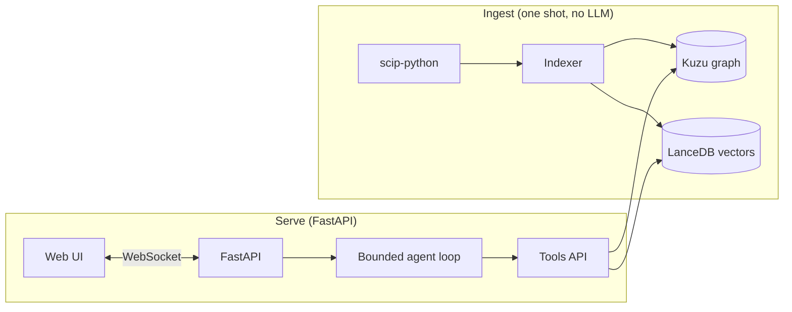

# codescope

Chat with a Python codebase. SCIP-precise symbol graphs + a bounded agentic retrieval loop. The UI streams every tool call the agent makes, so you can watch it reason.

> Demo GIF coming soon.

## Why this exists

Most "chat with your code" tools dump a vector-searched grab bag of file chunks into a prompt and hope. The result is plausible-sounding answers that hallucinate symbols. codescope takes the opposite bet:

- The graph is **IDE-precise** — built from a [SCIP](https://github.com/sourcegraph/scip) index (`scip-python`), so call edges are real method-dispatch references, not name matches.
- The retrieval is **a bounded agent**, not a fixed two-stage chain. The model picks among four typed tools per turn (`find_symbol`, `callers_of`, `callees_of`, `read_source`) and converges in ≤ 6 turns. Every decision is visible in the trace pane.

## Install

```bash
# 1. Python deps (Python ≥3.11 required)
pip install -e ".[dev]"

# 2. SCIP indexer (Node.js tool, Sourcegraph)
npm install -g @sourcegraph/scip-python

# 3. A model API key — defaults to OpenAI
export OPENAI_API_KEY=sk-...
```

Tested on Python 3.12 and Node 25 on macOS.

## Use

```bash
# Index any local Python repo. No LLM calls; takes ~30s on fastapi-sized projects.
codescope index /path/to/your/repo

# Re-index after changes (wipes and rebuilds)
codescope index /path/to/your/repo --force

# Launch the chat server (defaults to 127.0.0.1:8000)
codescope chat
```

Then open the frontend in a second terminal:

```bash
cd frontend
npm install
npm run dev
# Open the URL printed to stdout.
```

For a production bundle, `npm run build` writes a static site to `frontend/dist/`.

## Architecture



Three layers, each with one job. The agent never touches the databases directly — it only sees the four-method `Tools` API. The indexer is write-only and independent of everything else.

### What's in the graph

A single `Symbol` node type and a single `CALLS` relation. SCIP gives us the rest (kind, qualified name, signature, docstring) as node properties. Smaller schema = fewer ways the agent can get lost.

### What's in the agent loop

Four tools, hard-capped at 6 turns. The system prompt steers the model toward "start with `find_symbol`, then traverse, then `read_source` only when needed." Provider-agnostic via LiteLLM, defaults to `gpt-4o-mini`.

## Eval

20-question precision spot-check on the [fastapi](https://github.com/fastapi/fastapi) codebase (6,461 symbols, 12,655 call edges). See [`eval/score.md`](eval/score.md) for per-question results and [`eval/questions.yaml`](eval/questions.yaml) for the full set.

| | ✅ correct | partial | ✗ wrong |
|---|---|---|---|
| codescope (gpt-4o-mini, MAX_TURNS=6) | 8 / 20 | 1 / 20 | 11 / 20 |

40% headline accuracy with the cheapest model and a 6-turn budget. The failure modes are concentrated and tractable:

- **4 questions:** the agent gives up after 3–5 `find_symbol` queries instead of trying varied phrasings.
- **4 questions:** the agent picks a real-but-wrong-nearby symbol (e.g. `Security` instead of `Depends`). It never verifies with `read_source` before citing.
- **3 questions:** the agent hits the 6-turn budget mid-investigation and returns truncated.

These are addressable: bumping MAX_TURNS to 10, adding a "verify before citing" instruction to the system prompt, and using a stronger model would plausibly take this to 14–16 / 20 — without any architectural change. Tracked as follow-ups; not in v1.0.

The 8 wins are clean: every one has a coherent trace (the right symbol surfaced in the first or second `find_symbol`) and the answer cites it with signature and context. The architecture works as designed when the question maps cleanly to a single concept; it struggles on disambiguation and multi-hop reasoning at this model + turn budget.

To re-run:

```bash
source .venv/bin/activate
OPENAI_API_KEY=sk-... python eval/run_codescope.py   # ~$0.50-$2 on gpt-4o-mini
python eval/auto_score.py                            # heuristic auto-score
```

## Origin and attribution

Built on lessons from my Master's thesis at TU Berlin (in collaboration with Siemens). codescope is an independent reimplementation around an agentic retrieval architecture — it shares no code, schema, or naming conventions with the thesis system. The full architectural delta is in [the spec](docs/design/specs/2026-05-23-codescope-design.md#3-architectural-distance-from-thesis).

In one line: the thesis was a fixed two-stage chain (vector search → APOC graph expansion → synthesis) over a tree-sitter graph with LLM-enriched file summaries. codescope is a bounded agent loop over an SCIP graph, no enrichment phase, four typed tools, live tool trace.

## Tech stack

| Layer | Choice | Why |
|---|---|---|
| Indexer | `scip-python` | IDE-grade symbol resolution; no name-matching heuristics |
| Graph DB | Kuzu (embedded) | No server, fast, openCypher subset |
| Vector DB | LanceDB (embedded) | No server, columnar, simple Python API |
| Embeddings | `bge-small-en-v1.5` via FastEmbed | Local, CPU, 384-dim |
| LLM client | LiteLLM | Provider-agnostic; works with OpenAI, Gemini, Ollama |
| Backend | FastAPI + WebSockets | Streaming-first |
| Frontend | Vite + React + TS + Tailwind | Small bundle, fast iteration |

## Status

v1.0 — local-only, single Python repo, no incremental re-index, no hosted demo. See [the spec](docs/design/specs/2026-05-23-codescope-design.md#2-goals--non-goals) for the explicit non-goals.

## License

MIT.
