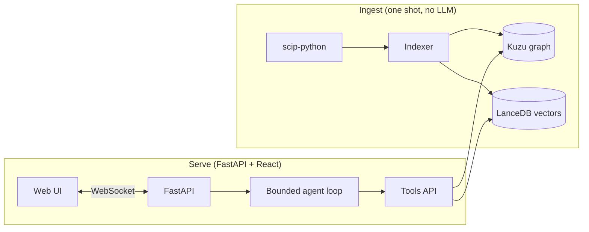
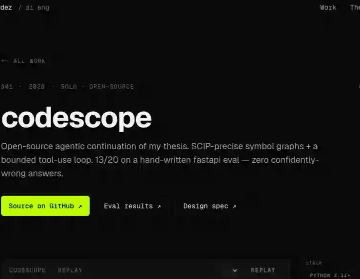

# codescope

**Chat with a Python codebase. SCIP-precise symbol graphs + a bounded agentic retrieval loop, with a live tool-trace UI that lets you watch the model reason.**





> The replay above is a real v4 (gpt-5) session against fastapi. Per-question reasoning traces for the full 20-question eval are in [`eval/results-gpt5-v4.jsonl`](eval/results-gpt5-v4.jsonl).

## Why this exists

Most "chat with your code" tools do a single vector search, dump the top-k file chunks into a prompt, and hope. Answers sound plausible but hallucinate symbols. codescope takes the opposite bet:

- The graph is **IDE-precise** — built from a [SCIP](https://github.com/sourcegraph/scip) index produced by `scip-python`, so call edges are real method-dispatch references, not name matches.
- The retrieval is **a bounded agent**, not a fixed pipeline. The model picks among four typed tools per turn (`find_symbol`, `callers_of`, `callees_of`, `read_source`) and converges in ≤ 20 turns. Every decision is visible in the trace pane.

## Background and attribution

This project is an open-source continuation of research originally conducted as my Master's thesis at TU Berlin, in collaboration with **Siemens Mobility**. The original thesis system is the proprietary intellectual property of Siemens Mobility and TU Berlin and is not publicly available.

**codescope is an independent, clean-room reimplementation.** It was designed and built from scratch around a fundamentally different architectural approach — replacing the thesis's fixed two-stage retrieval chain with a bounded agentic tool-use loop. It shares **no source code, database schema, naming conventions, or technology stack** with the thesis system. The full architectural delta is documented in the design spec at [`docs/design/specs/2026-05-23-codescope-design.md`](docs/design/specs/2026-05-23-codescope-design.md#3-architectural-distance-from-thesis).

### How the thesis system worked, in brief

The thesis system applied Knowledge-Graph-Augmented Retrieval to source code. Its pipeline:

1. **Polyglot parsing** with tree-sitter (Python, C, C++).
2. **Graph construction** in Neo4j with five node types (File / Class / Function / Struct / Namespace) and four relations (DEFINES / IMPORTS / INCLUDES / CALLS). Relation precision was mixed — `CALLS` was inferred from static name matching rather than resolved references.
3. **An LLM enrichment phase** that generated a semantic summary for every file node. The summaries were the embedding source for vector search. This phase was expensive: ~72 hours to enrich TensorFlow-scale repos.
4. **FAISS** for the vector store.
5. **A fixed two-stage retrieval pipeline**: vector search over file summaries → APOC `subgraphAll` graph expansion → final LLM synthesis. The model made no decisions during retrieval; the pipeline was the algorithm.
6. **Streamlit** for the UI.

The thesis's main contribution was demonstrating that the enrichment + graph-expansion combination meaningfully outperformed pure vector-RAG baselines on code understanding tasks.

### How codescope is different

codescope keeps the *problem* (chat with a repo) but rebuilds every architectural layer below it:

| Layer | Thesis system | codescope |
|---|---|---|
| Languages supported | Python, C, C++ | Python only |
| Parser & symbol resolution | tree-sitter + static name matching | `scip-python` (IDE-grade resolved references) |
| Graph DB | Neo4j (server) | Kuzu (embedded) |
| Graph schema | 5 node types + 4 relations, mixed precision | 1 node type + 1 relation, all SCIP-precise |
| What's embedded | LLM-generated file summaries | symbol's own docstring + signature |
| Index-time LLM cost | hours to days (enrichment phase) | zero (no LLM at index time) |
| Vector DB | FAISS | LanceDB (embedded) |
| Retrieval shape | Fixed two-stage pipeline | Bounded agent loop, 4 tools, ≤20 turns |
| LLM orchestration | LangChain | LiteLLM + ~50 lines of agent code |
| UI | Streamlit | FastAPI + React, with live trace pane |

The retrieval architecture is the deepest change. The thesis pipeline made every decision upfront; codescope makes them at inference time, one tool call per turn, with the trace visible to the user.

## How codescope works

### Index time

```bash
codescope index /path/to/your/python/repo
```

Runs `scip-python` over the repo, parses the protobuf output, writes Symbol nodes + CALLS edges to Kuzu and embeddings of (qualified name + signature + docstring) into LanceDB. No LLM calls during indexing — typically 10-60 seconds depending on repo size.

### Query time

When you ask a question, the agent loop runs:

1. **System prompt** instructs it to prefer `find_symbol` first, then traverse via `callers_of` / `callees_of`, then `read_source` only when needed.
2. The model picks a tool, the server dispatches it, the result feeds back into the loop.
3. Trace events stream to the UI over a WebSocket so you watch every decision live.
4. After at most 20 turns, the model produces a final answer citing symbols by qualified name.

### The four tools

```python
find_symbol(query, kind=None, k=5)     # semantic search over symbol docs + signatures
callers_of(symbol_id, depth=1)          # who calls this symbol
callees_of(symbol_id, depth=1)          # what this symbol calls
read_source(symbol_id, with_context_lines=0)  # the actual code
```

Everything else is plumbing. The minimal API is the whole point: fewer choices for the model, more interpretable traces, easier to debug.

## Install

```bash
# 1. Python deps (Python ≥3.11)
pip install -e ".[dev]"

# 2. SCIP indexer (Node.js tool from Sourcegraph)
npm install -g @sourcegraph/scip-python

# 3. Model API key — defaults to OpenAI
export OPENAI_API_KEY=sk-...
```

Tested on Python 3.12 and Node 25 on macOS.

## Use

```bash
# Index a Python repo. No LLM calls; ~30s on fastapi-sized projects.
codescope index /path/to/your/repo

# Launch the chat server.
codescope chat
```

Then run the dev frontend in a second terminal:

```bash
cd frontend
npm install
npm run dev
# Open the printed URL.
```

For a production build, `npm run build` produces a static bundle under `frontend/dist/`.

## Eval

20-question precision spot-check on the [fastapi](https://github.com/fastapi/fastapi) codebase (6,461 symbols, 12,655 call edges). Hand-written questions, every `expected_symbol` verified to exist in the indexed graph. See [`eval/score.md`](eval/score.md) for the full per-question breakdown.

| run | model | MAX_TURNS | extras | ✅ | partial | ✗ |
|-----|-------|-----------|--------|----|---------|----|
| v1 | gpt-4o-mini | 6  | original                                              | 8  | 1 | 11 |
| v2 | gpt-5-nano  | 10 | + verify-before-cite                                  | 8  | 0 | 12 |
| v3 | gpt-5-nano  | 20 | + verify-before-cite                                  | 10 | 0 | 10 |
| **v4** | **gpt-5** | **20** | **+ verify + anti-loop + re-rank-by-callers** | **13** | **1** | **6** |

**v4: 65% correct, +62% relative improvement over v1**, with zero confidently-wrong answers across all four runs. Every miss in v2/v3/v4 is an honest "still investigating, ran out of turns" — not "wrong answer with confidence." That's the failure profile a real developer tool should have.

### What each iteration changed (and why)

The four-run progression isn't arbitrary — each step targeted a specific failure pattern from the previous run.

- **v1 baseline (8/20).** Default gpt-4o-mini, MAX_TURNS=6, generic prompt. Found 4 confidently-wrong answers (e.g. citing `Security` when the question was about `Depends`). Also gave up too quickly on 4 questions.

- **v2: instruction tuning (8/20).** Added a "before citing a symbol, use `read_source` to verify it actually does what was asked" rule to the system prompt. Switched to `gpt-5-nano` for better instruction-following. The number didn't move, but the *failure mode* shifted entirely: zero confidently-wrong, all 12 misses were honest turn-budget truncations. The agent was now over-verifying — too cautious for the 10-turn budget.

- **v3: budget tuning (10/20).** Same prompt and model, bumped MAX_TURNS to 20. The more careful agent had room to complete its verification chain on two more questions (`include_router`, `HTTPBearer`).

- **v4: retrieval tuning + stronger model (13/20).** Three changes: (a) added an anti-search-loop rule to the prompt ("if find_symbol returns the same hits twice, stop searching and verify the best candidate"), (b) re-ranked `find_symbol` results by blending vector similarity with `log1p(caller_count) * 0.15` — central symbols with many callers now surface above near-semantic-matches that are unused, (c) upgraded to `gpt-5`. Three new wins (q01 `get_openapi`, q02 `APIRoute`, q10 `get_route_handler`) — all central, high-fan-in symbols that the caller-count re-rank was specifically designed to surface.

The 6 v4 failures are all hard multi-hop questions where the agent was making genuine progress when the 20-turn budget hit. A stronger model + bigger budget would recover most of them at higher cost. v4 is a deliberate sweet spot.

### Re-running the eval

```bash
source .venv/bin/activate
OPENAI_API_KEY=sk-... python eval/run_codescope.py --model gpt-5 --out eval/results-<version>.jsonl
python eval/auto_score.py
```

## Tech stack

| Layer | Choice | Why |
|---|---|---|
| Indexer | `scip-python` | IDE-grade symbol resolution; no name-matching heuristics |
| Graph DB | Kuzu (embedded) | No server, openCypher subset, fast |
| Vector DB | LanceDB (embedded) | No server, columnar, simple Python API |
| Embeddings | `bge-small-en-v1.5` via FastEmbed | Local, CPU, 384-dim |
| LLM client | LiteLLM | Provider-agnostic — OpenAI, Anthropic, Gemini, Ollama |
| Backend | FastAPI + WebSockets | Streaming-first |
| Frontend | Vite + React + TypeScript + Tailwind | Small bundle, fast iteration |

## Project layout

```
src/codescope/
  indexer/      one-shot: scip-python → Kuzu + LanceDB
  store/        4-method Tools API over the indexed graph
  agent/        bounded LiteLLM tool-use loop
  web/          FastAPI server + WebSocket trace streaming
frontend/
  src/          React UI with chat pane + live trace pane
eval/
  questions.yaml         20 hand-written fastapi questions
  run_codescope.py       runs the eval
  auto_score.py          heuristic scorer (manually reviewed)
  results-*.jsonl        evidence for each scored row
  score.md               full per-question + per-run analysis
docs/
  design/specs/          design spec
  design/plans/          implementation plan
```

## Status

v1.0 — local-only, single Python repo at a time, no incremental re-index, no hosted demo. Out of scope for v1.0 per the [design spec §2](docs/design/specs/2026-05-23-codescope-design.md#2-goals--non-goals): multi-language, hosted multi-user demo, persistent chat history, graph visualization, test↔code linkage. Candidates for v1.1.

## License

MIT.
