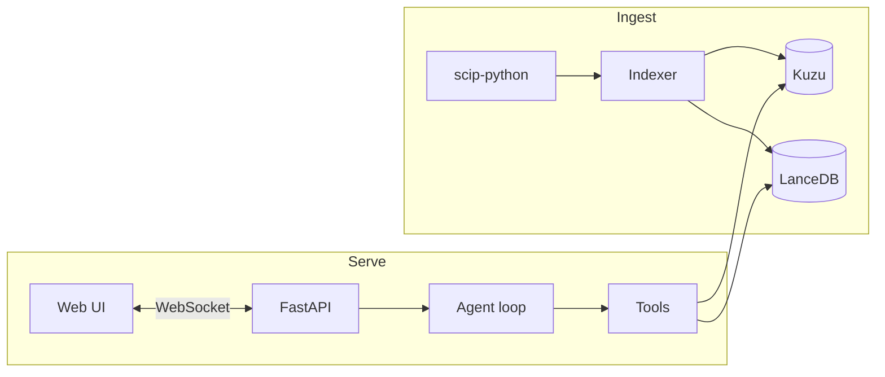

# codescope v1.0 Implementation Plan

> **For agentic workers:** REQUIRED SUB-SKILL: Use superpowers:subagent-driven-development (recommended) or superpowers:executing-plans to implement this plan task-by-task. Steps use checkbox (`- [ ]`) syntax for tracking.

**Goal:** Ship a public, OSS, portfolio-grade repo that lets you chat with a Python codebase using SCIP-precise symbol graphs and a bounded agentic retrieval loop, with a live tool-trace UI as the demo centerpiece.

**Architecture:** Four units. `indexer` ingests a repo via `scip-python` into Kuzu (graph) + LanceDB (vectors), one shot, no LLM calls. `store` exposes 4 typed retrieval tools over those DBs. `agent` is a bounded LiteLLM loop (≤6 turns) that picks among those tools. `web` is FastAPI + React with a WebSocket streaming live tool traces. Layering: `web` → `agent` → `store` → DBs; `indexer` is write-only and independent.

**Tech Stack:** Python 3.11+, `scip-python` (Sourcegraph), Kuzu (embedded graph DB), LanceDB (embedded vector DB), `fastembed` (bge-small-en-v1.5), LiteLLM, FastAPI + WebSockets, Typer CLI, Vite + React + TypeScript + Tailwind, pytest, ruff, mypy.

**Spec:** [`docs/superpowers/specs/2026-05-23-codescope-design.md`](../specs/2026-05-23-codescope-design.md). This plan implements it task-by-task.

**TDD discipline:** Every task is *test first*, run-to-fail, then minimal implementation, then run-to-pass, then commit. Skipping the run-to-fail step on Python tasks is grounds for redoing the task.

**Frontend exception:** React tasks (W2-9 through W2-12) use `vitest` + `@testing-library/react` for component behavior, but rendering polish (Tailwind tweaks) is verified visually, not by tests — that's a deliberate scope cut for a portfolio repo.

---

## Weekend 1 — Ingest + Store

**Milestone:** `codescope index ./fastapi` runs end-to-end and `Tools(...)` returns real results when called from a Python REPL.

### Task W1-1: Project scaffold

**Files:**
- Create: `pyproject.toml`
- Create: `.gitignore`
- Create: `ruff.toml`
- Create: `tests/conftest.py`
- Create: `src/codescope/__init__.py`

- [ ] **Step 1: Initialize git and create directories**

```bash
cd "/Users/alberto/projects/Personal Projects/codescope"
git init
mkdir -p src/codescope tests/unit tests/integration tests/fixtures
```

- [ ] **Step 2: Write pyproject.toml**

```toml
[project]
name = "codescope"
version = "0.1.0"
description = "Chat with a Python codebase via SCIP-precise symbol graphs and agentic retrieval."
requires-python = ">=3.11"
license = { text = "MIT" }
dependencies = [
  "typer>=0.12",
  "kuzu>=0.7",
  "lancedb>=0.13",
  "fastembed>=0.4",
  "protobuf>=5",
  "litellm>=1.50",
  "fastapi>=0.115",
  "uvicorn[standard]>=0.32",
  "websockets>=13",
]

[project.optional-dependencies]
dev = [
  "pytest>=8",
  "pytest-asyncio>=0.24",
  "ruff>=0.7",
  "mypy>=1.13",
  "httpx>=0.27",      # for FastAPI TestClient
]

[project.scripts]
codescope = "codescope.cli:app"

[build-system]
requires = ["hatchling"]
build-backend = "hatchling.build"

[tool.pytest.ini_options]
testpaths = ["tests"]
asyncio_mode = "auto"
```

- [ ] **Step 3: Write ruff.toml**

```toml
line-length = 100
target-version = "py311"

[lint]
select = ["E", "F", "W", "I", "B", "UP", "SIM"]
```

- [ ] **Step 4: Write .gitignore**

```gitignore
__pycache__/
*.pyc
.venv/
.codescope/
*.scip
.pytest_cache/
.ruff_cache/
.mypy_cache/
dist/
build/
*.egg-info/
node_modules/
frontend/dist/
.DS_Store
```

- [ ] **Step 5: Empty conftest.py and package init**

```python
# tests/conftest.py
```

```python
# src/codescope/__init__.py
__version__ = "0.1.0"
```

- [ ] **Step 6: Create venv, install, verify**

```bash
python3.11 -m venv .venv
source .venv/bin/activate
pip install -e ".[dev]"
pytest --version
ruff --version
```

Expected: both commands print versions, no errors.

- [ ] **Step 7: Commit**

```bash
git add pyproject.toml ruff.toml .gitignore tests/conftest.py src/codescope/__init__.py
git commit -m "chore: project scaffold"
```

---

### Task W1-2: CI workflow

**Files:**
- Create: `.github/workflows/ci.yml`

- [ ] **Step 1: Write CI workflow**

```yaml
name: ci
on:
  push:
    branches: [main]
  pull_request:
jobs:
  test:
    runs-on: ubuntu-latest
    steps:
      - uses: actions/checkout@v4
      - uses: actions/setup-python@v5
        with:
          python-version: "3.11"
      - run: pip install -e ".[dev]"
      - run: ruff check .
      - run: pytest -v
```

- [ ] **Step 2: Commit**

```bash
git add .github/workflows/ci.yml
git commit -m "ci: add lint + test workflow"
```

---

### Task W1-3: Test fixture — tiny Python repo

A minimal 3-file Python "project" so unit tests don't need to clone `fastapi` every run.

**Files:**
- Create: `tests/fixtures/tiny_repo/pyproject.toml`
- Create: `tests/fixtures/tiny_repo/tiny/__init__.py`
- Create: `tests/fixtures/tiny_repo/tiny/auth.py`
- Create: `tests/fixtures/tiny_repo/tiny/api.py`

- [ ] **Step 1: Write tiny_repo files**

```toml
# tests/fixtures/tiny_repo/pyproject.toml
[project]
name = "tiny"
version = "0.0.1"
requires-python = ">=3.11"
```

```python
# tests/fixtures/tiny_repo/tiny/__init__.py
```

```python
# tests/fixtures/tiny_repo/tiny/auth.py
"""Authentication primitives."""


def verify_token(token: str) -> bool:
    """Return True if the token is valid.

    A token is considered valid if it is non-empty and starts with 'tk_'.
    """
    return bool(token) and token.startswith("tk_")


def issue_token(user_id: str) -> str:
    """Mint a new token for the given user id."""
    return f"tk_{user_id}"
```

```python
# tests/fixtures/tiny_repo/tiny/api.py
"""HTTP-shaped helpers that lean on auth."""

from tiny.auth import verify_token


def authorize_request(token: str) -> dict:
    """Authorize an incoming request; returns a status dict."""
    if verify_token(token):
        return {"ok": True}
    return {"ok": False, "reason": "invalid_token"}
```

- [ ] **Step 2: Commit**

```bash
git add tests/fixtures/tiny_repo
git commit -m "test: add tiny_repo fixture"
```

---

### Task W1-4: `scip_runner` — subprocess wrapper

**Files:**
- Create: `src/codescope/indexer/__init__.py`
- Create: `src/codescope/indexer/scip_runner.py`
- Create: `tests/unit/test_scip_runner.py`

`scip-python` is the Sourcegraph SCIP indexer for Python. Install via `npm install -g @sourcegraph/scip-python`. It emits a binary protobuf file containing every symbol in the repo with full reference resolution.

- [ ] **Step 1: Write the failing test**

```python
# tests/unit/test_scip_runner.py
import shutil
from pathlib import Path

import pytest

from codescope.indexer.scip_runner import ScipNotInstalledError, run_scip

TINY_REPO = Path(__file__).parent.parent / "fixtures" / "tiny_repo"


def test_run_scip_against_tiny_repo_creates_index_file(tmp_path):
    if not shutil.which("scip-python"):
        pytest.skip("scip-python not installed")
    output = tmp_path / "index.scip"
    run_scip(repo_path=TINY_REPO, output=output)
    assert output.exists()
    assert output.stat().st_size > 0


def test_run_scip_raises_when_binary_missing(monkeypatch, tmp_path):
    monkeypatch.setattr("shutil.which", lambda _: None)
    with pytest.raises(ScipNotInstalledError):
        run_scip(repo_path=tmp_path, output=tmp_path / "x.scip")
```

- [ ] **Step 2: Run test to verify it fails**

```bash
pytest tests/unit/test_scip_runner.py -v
```

Expected: ImportError on `codescope.indexer.scip_runner`.

- [ ] **Step 3: Write minimal implementation**

```python
# src/codescope/indexer/__init__.py
```

```python
# src/codescope/indexer/scip_runner.py
"""Wrapper around the `scip-python` CLI."""

from __future__ import annotations

import shutil
import subprocess
from pathlib import Path


class ScipNotInstalledError(RuntimeError):
    """Raised when the scip-python binary is not on PATH."""

    INSTALL_HINT = (
        "scip-python not found on PATH. Install with:\n"
        "    npm install -g @sourcegraph/scip-python"
    )

    def __init__(self) -> None:
        super().__init__(self.INSTALL_HINT)


def run_scip(repo_path: Path, output: Path) -> None:
    """Run `scip-python index` against repo_path, writing to output."""
    if not shutil.which("scip-python"):
        raise ScipNotInstalledError()
    output.parent.mkdir(parents=True, exist_ok=True)
    subprocess.run(
        ["scip-python", "index", "--output", str(output), str(repo_path)],
        check=True,
    )
```

- [ ] **Step 4: Run tests**

```bash
pytest tests/unit/test_scip_runner.py -v
```

Expected: PASS (both tests; first may skip if scip-python isn't installed).

- [ ] **Step 5: Commit**

```bash
git add src/codescope/indexer tests/unit/test_scip_runner.py
git commit -m "feat(indexer): scip-python subprocess wrapper"
```

---

### Task W1-5: `scip_parser` — protobuf to Symbol records

SCIP is a protobuf format defined at https://github.com/sourcegraph/scip/blob/main/scip.proto. We need: per-file, the symbols defined and the references (calls) between them. We'll use the `scip` PyPI package (it bundles the generated proto code).

**If `pip install scip` fails or the import path differs**, fall back to generating the proto bindings yourself:

```bash
pip install protobuf grpcio-tools
curl -L https://raw.githubusercontent.com/sourcegraph/scip/main/scip.proto -o /tmp/scip.proto
python -m grpc_tools.protoc -I/tmp --python_out=src/codescope/indexer /tmp/scip.proto
# Then `from codescope.indexer import scip_pb2` instead of `from scip import scip_pb2`.
```

The rest of the task code is identical either way — only the import line changes.

**Files:**
- Modify: `pyproject.toml` (add `scip>=0.3` dependency)
- Create: `src/codescope/indexer/scip_parser.py`
- Create: `tests/unit/test_scip_parser.py`

- [ ] **Step 1: Add dependency**

In `pyproject.toml`, append `"scip>=0.3"` to `dependencies`. Then:

```bash
pip install -e ".[dev]"
```

- [ ] **Step 2: Write the failing test**

```python
# tests/unit/test_scip_parser.py
import shutil
from pathlib import Path

import pytest

from codescope.indexer.scip_parser import parse_index, SymbolRecord, CallRecord
from codescope.indexer.scip_runner import run_scip

TINY_REPO = Path(__file__).parent.parent / "fixtures" / "tiny_repo"


@pytest.fixture(scope="module")
def tiny_index(tmp_path_factory):
    if not shutil.which("scip-python"):
        pytest.skip("scip-python not installed")
    out = tmp_path_factory.mktemp("scip") / "index.scip"
    run_scip(repo_path=TINY_REPO, output=out)
    return out


def test_parse_index_yields_known_symbols(tiny_index):
    symbols, calls = parse_index(tiny_index)
    names = {s.qualified_name for s in symbols}
    assert "tiny.auth.verify_token" in names
    assert "tiny.auth.issue_token" in names
    assert "tiny.api.authorize_request" in names


def test_symbol_record_has_doc_and_signature(tiny_index):
    symbols, _ = parse_index(tiny_index)
    vt = next(s for s in symbols if s.qualified_name == "tiny.auth.verify_token")
    assert vt.kind == "Function"
    assert vt.file.endswith("auth.py")
    assert "Return True if the token is valid" in vt.doc


def test_parse_index_emits_call_from_authorize_to_verify(tiny_index):
    _, calls = parse_index(tiny_index)
    edges = {(c.caller_qualified_name, c.callee_qualified_name) for c in calls}
    assert ("tiny.api.authorize_request", "tiny.auth.verify_token") in edges
```

- [ ] **Step 3: Run test to verify it fails**

```bash
pytest tests/unit/test_scip_parser.py -v
```

Expected: ImportError on `codescope.indexer.scip_parser`.

- [ ] **Step 4: Write implementation**

```python
# src/codescope/indexer/scip_parser.py
"""Parse a SCIP protobuf index into Symbol and Call records.

SCIP monikers look like:
    scip-python python . tiny/auth.py/verify_token().

We convert these to qualified names like `tiny.auth.verify_token` for citation.
"""

from __future__ import annotations

import re
from dataclasses import dataclass
from pathlib import Path

from scip import scip_pb2


@dataclass(frozen=True)
class SymbolRecord:
    id: str  # raw SCIP moniker
    name: str
    qualified_name: str
    kind: str  # 'Function' | 'Class' | 'Method' | 'Module' | 'Variable'
    file: str
    start_line: int
    end_line: int
    doc: str
    signature: str


@dataclass(frozen=True)
class CallRecord:
    caller_id: str
    callee_id: str
    caller_qualified_name: str
    callee_qualified_name: str
    file: str
    line: int


# SCIP descriptor suffixes that indicate symbol kind.
_KIND_BY_SUFFIX = {
    "().": "Function",
    "(.).": "Method",
    "#": "Class",
    "/": "Module",
    ".": "Variable",
}


def _kind_from_moniker(moniker: str) -> str:
    for suffix, kind in _KIND_BY_SUFFIX.items():
        if moniker.endswith(suffix):
            return kind
    return "Variable"


def _qualified_name_from_moniker(moniker: str) -> str:
    """Convert a SCIP moniker to a dotted qualified name.

    e.g. 'scip-python python . tiny/auth.py/verify_token().'
      -> 'tiny.auth.verify_token'
    """
    # Take the path portion after the package descriptor.
    parts = moniker.split(" ", 4)
    descriptor = parts[-1] if len(parts) >= 4 else moniker
    # Strip kind suffix
    cleaned = re.sub(r"(\(\)|\(\.\)|#|/)\.?$", "", descriptor)
    # Normalize: replace / with ., drop .py from module portion
    cleaned = cleaned.replace(".py/", ".").replace("/", ".")
    cleaned = cleaned.rstrip(".")
    return cleaned


def parse_index(scip_path: Path) -> tuple[list[SymbolRecord], list[CallRecord]]:
    index = scip_pb2.Index()
    index.ParseFromString(Path(scip_path).read_bytes())

    # Build a map of symbol id -> SymbolInformation for doc/signature.
    info_by_symbol: dict[str, scip_pb2.SymbolInformation] = {}
    for doc in index.documents:
        for s in doc.symbols:
            info_by_symbol[s.symbol] = s

    symbols: list[SymbolRecord] = []
    calls: list[CallRecord] = []
    seen_symbol_ids: set[str] = set()

    for doc in index.documents:
        file_path = doc.relative_path
        defs_in_file: list[tuple[scip_pb2.Occurrence, str]] = []  # (occ, symbol_id)

        for occ in doc.occurrences:
            is_def = occ.symbol_roles & scip_pb2.SymbolRole.Definition
            if is_def and occ.symbol not in seen_symbol_ids:
                info = info_by_symbol.get(occ.symbol)
                doc_text = ""
                signature = ""
                if info:
                    doc_text = "\n".join(info.documentation)
                    if info.signature_documentation.text:
                        signature = info.signature_documentation.text
                start = occ.range[0] if len(occ.range) >= 1 else 0
                end = occ.range[2] if len(occ.range) >= 3 else start
                qn = _qualified_name_from_moniker(occ.symbol)
                symbols.append(
                    SymbolRecord(
                        id=occ.symbol,
                        name=qn.rsplit(".", 1)[-1] if "." in qn else qn,
                        qualified_name=qn,
                        kind=_kind_from_moniker(occ.symbol),
                        file=file_path,
                        start_line=start,
                        end_line=end,
                        doc=doc_text,
                        signature=signature,
                    )
                )
                seen_symbol_ids.add(occ.symbol)
                defs_in_file.append((occ, occ.symbol))

        # Second pass: references inside this doc, mapped to the enclosing def.
        for occ in doc.occurrences:
            if occ.symbol_roles & scip_pb2.SymbolRole.Definition:
                continue
            ref_line = occ.range[0] if len(occ.range) >= 1 else 0
            enclosing = _enclosing_def(defs_in_file, ref_line)
            if not enclosing or enclosing == occ.symbol:
                continue
            calls.append(
                CallRecord(
                    caller_id=enclosing,
                    callee_id=occ.symbol,
                    caller_qualified_name=_qualified_name_from_moniker(enclosing),
                    callee_qualified_name=_qualified_name_from_moniker(occ.symbol),
                    file=file_path,
                    line=ref_line,
                )
            )

    return symbols, calls


def _enclosing_def(defs: list[tuple[scip_pb2.Occurrence, str]], line: int) -> str | None:
    """Return the symbol id of the closest preceding definition on or before `line`."""
    best: tuple[int, str] | None = None
    for occ, sid in defs:
        d_line = occ.range[0] if len(occ.range) >= 1 else 0
        if d_line <= line and (best is None or d_line > best[0]):
            best = (d_line, sid)
    return best[1] if best else None
```

- [ ] **Step 5: Run tests**

```bash
pytest tests/unit/test_scip_parser.py -v
```

Expected: PASS all three (or SKIP if scip-python isn't installed).

- [ ] **Step 6: Commit**

```bash
git add pyproject.toml src/codescope/indexer/scip_parser.py tests/unit/test_scip_parser.py
git commit -m "feat(indexer): SCIP protobuf parser → Symbol+Call records"
```

---

### Task W1-6: `kuzu_writer` — graph schema + batched writes

Kuzu is an embedded graph database (Python wheels available; no server). API similar to DuckDB: connect, execute Cypher, done.

**Files:**
- Create: `src/codescope/indexer/kuzu_writer.py`
- Create: `tests/unit/test_kuzu_writer.py`

- [ ] **Step 1: Write the failing test**

```python
# tests/unit/test_kuzu_writer.py
import kuzu

from codescope.indexer.kuzu_writer import KuzuWriter
from codescope.indexer.scip_parser import SymbolRecord, CallRecord


def _sample_symbols() -> list[SymbolRecord]:
    return [
        SymbolRecord(
            id="scip://.../verify_token().",
            name="verify_token",
            qualified_name="tiny.auth.verify_token",
            kind="Function",
            file="tiny/auth.py",
            start_line=4,
            end_line=10,
            doc="Return True if the token is valid.",
            signature="def verify_token(token: str) -> bool",
        ),
        SymbolRecord(
            id="scip://.../authorize_request().",
            name="authorize_request",
            qualified_name="tiny.api.authorize_request",
            kind="Function",
            file="tiny/api.py",
            start_line=6,
            end_line=10,
            doc="Authorize an incoming request.",
            signature="def authorize_request(token: str) -> dict",
        ),
    ]


def _sample_calls() -> list[CallRecord]:
    return [
        CallRecord(
            caller_id="scip://.../authorize_request().",
            callee_id="scip://.../verify_token().",
            caller_qualified_name="tiny.api.authorize_request",
            callee_qualified_name="tiny.auth.verify_token",
            file="tiny/api.py",
            line=8,
        )
    ]


def test_kuzu_writer_persists_symbols_and_call_edges(tmp_path):
    db_path = tmp_path / "graph.kuzu"
    writer = KuzuWriter(db_path)
    writer.create_schema()
    writer.write_symbols(_sample_symbols())
    writer.write_calls(_sample_calls())
    writer.close()

    db = kuzu.Database(str(db_path))
    conn = kuzu.Connection(db)
    result = conn.execute("MATCH (s:Symbol) RETURN count(s) AS n").get_as_df()
    assert result["n"][0] == 2

    result = conn.execute(
        "MATCH (a:Symbol)-[:CALLS]->(b:Symbol) "
        "RETURN a.qualified_name AS caller, b.qualified_name AS callee"
    ).get_as_df()
    assert len(result) == 1
    assert result["caller"][0] == "tiny.api.authorize_request"
    assert result["callee"][0] == "tiny.auth.verify_token"
```

- [ ] **Step 2: Run test to verify it fails**

```bash
pytest tests/unit/test_kuzu_writer.py -v
```

Expected: ImportError on `codescope.indexer.kuzu_writer`.

- [ ] **Step 3: Write implementation**

```python
# src/codescope/indexer/kuzu_writer.py
"""Write SymbolRecord + CallRecord batches into a Kuzu embedded graph DB."""

from __future__ import annotations

from pathlib import Path

import kuzu

from codescope.indexer.scip_parser import CallRecord, SymbolRecord

_BATCH = 1000

_SCHEMA = [
    """
    CREATE NODE TABLE Symbol(
      id              STRING,
      name            STRING,
      qualified_name  STRING,
      kind            STRING,
      file            STRING,
      start_line      INT64,
      end_line        INT64,
      doc             STRING,
      signature       STRING,
      PRIMARY KEY (id)
    )
    """,
    "CREATE REL TABLE CALLS (FROM Symbol TO Symbol)",
]


class KuzuWriter:
    def __init__(self, db_path: Path) -> None:
        self.db_path = Path(db_path)
        self.db_path.parent.mkdir(parents=True, exist_ok=True)
        self._db = kuzu.Database(str(self.db_path))
        self._conn = kuzu.Connection(self._db)

    def create_schema(self) -> None:
        for stmt in _SCHEMA:
            self._conn.execute(stmt)

    def write_symbols(self, symbols: list[SymbolRecord]) -> None:
        # Kuzu supports parameterized batch inserts via UNWIND.
        for i in range(0, len(symbols), _BATCH):
            batch = symbols[i : i + _BATCH]
            self._conn.execute(
                """
                UNWIND $rows AS row
                CREATE (s:Symbol {
                  id: row.id,
                  name: row.name,
                  qualified_name: row.qualified_name,
                  kind: row.kind,
                  file: row.file,
                  start_line: row.start_line,
                  end_line: row.end_line,
                  doc: row.doc,
                  signature: row.signature
                })
                """,
                {"rows": [s.__dict__ for s in batch]},
            )

    def write_calls(self, calls: list[CallRecord]) -> None:
        # Deduplicate edges in-memory before insert.
        unique = {(c.caller_id, c.callee_id) for c in calls}
        rows = [{"src": a, "dst": b} for a, b in unique]
        for i in range(0, len(rows), _BATCH):
            batch = rows[i : i + _BATCH]
            self._conn.execute(
                """
                UNWIND $rows AS row
                MATCH (a:Symbol {id: row.src}), (b:Symbol {id: row.dst})
                CREATE (a)-[:CALLS]->(b)
                """,
                {"rows": batch},
            )

    def close(self) -> None:
        # kuzu cleans up via GC; explicit method for symmetry.
        self._conn = None
        self._db = None
```

- [ ] **Step 4: Run tests**

```bash
pytest tests/unit/test_kuzu_writer.py -v
```

Expected: PASS.

- [ ] **Step 5: Commit**

```bash
git add src/codescope/indexer/kuzu_writer.py tests/unit/test_kuzu_writer.py
git commit -m "feat(indexer): Kuzu schema + batched writer"
```

---

### Task W1-7: `embedder` + `lance_writer`

**Files:**
- Create: `src/codescope/indexer/embedder.py`
- Create: `src/codescope/indexer/lance_writer.py`
- Create: `tests/unit/test_lance_writer.py`

- [ ] **Step 1: Write the failing test**

```python
# tests/unit/test_lance_writer.py
import lancedb

from codescope.indexer.embedder import Embedder
from codescope.indexer.lance_writer import LanceWriter
from codescope.indexer.scip_parser import SymbolRecord


def _docs() -> list[SymbolRecord]:
    return [
        SymbolRecord(
            id="x://verify_token",
            name="verify_token",
            qualified_name="tiny.auth.verify_token",
            kind="Function",
            file="tiny/auth.py",
            start_line=4,
            end_line=10,
            doc="Return True if the token is valid.",
            signature="def verify_token(token: str) -> bool",
        ),
        SymbolRecord(
            id="x://undocumented",
            name="helper",
            qualified_name="tiny.internal.helper",
            kind="Function",
            file="tiny/internal.py",
            start_line=1,
            end_line=3,
            doc="",  # undocumented → must NOT be embedded
            signature="def helper()",
        ),
    ]


def test_lance_writer_embeds_only_documented_symbols(tmp_path):
    embedder = Embedder()
    writer = LanceWriter(tmp_path / "vec.lance", embedder=embedder)
    writer.write(_docs())

    db = lancedb.connect(str(tmp_path / "vec.lance"))
    table = db.open_table("symbols")
    rows = table.to_pandas()
    assert len(rows) == 1
    assert rows["symbol_id"][0] == "x://verify_token"
    assert len(rows["vector"][0]) == 384
```

- [ ] **Step 2: Run test to verify it fails**

```bash
pytest tests/unit/test_lance_writer.py -v
```

Expected: ImportError.

- [ ] **Step 3: Write embedder**

```python
# src/codescope/indexer/embedder.py
"""bge-small embeddings via fastembed. CPU-only, ~80MB model, 384 dims."""

from __future__ import annotations

from fastembed import TextEmbedding

_MODEL = "BAAI/bge-small-en-v1.5"
_DIM = 384


class Embedder:
    def __init__(self) -> None:
        self._model = TextEmbedding(model_name=_MODEL)

    @property
    def dim(self) -> int:
        return _DIM

    def embed(self, texts: list[str]) -> list[list[float]]:
        return [vec.tolist() for vec in self._model.embed(texts)]
```

- [ ] **Step 4: Write lance_writer**

```python
# src/codescope/indexer/lance_writer.py
"""Write per-symbol embeddings to a LanceDB table."""

from __future__ import annotations

from pathlib import Path

import lancedb

from codescope.indexer.embedder import Embedder
from codescope.indexer.scip_parser import SymbolRecord


def _embedding_text(s: SymbolRecord) -> str:
    """Concatenate name + signature + doc into one searchable blob."""
    parts = [s.qualified_name]
    if s.signature:
        parts.append(s.signature)
    if s.doc:
        parts.append(s.doc[:500])
    return "\n".join(parts)


class LanceWriter:
    def __init__(self, db_path: Path, embedder: Embedder) -> None:
        self.db_path = Path(db_path)
        self.db_path.parent.mkdir(parents=True, exist_ok=True)
        self._db = lancedb.connect(str(self.db_path))
        self._embedder = embedder

    def write(self, symbols: list[SymbolRecord]) -> None:
        documented = [s for s in symbols if s.doc and s.doc.strip()]
        if not documented:
            return
        texts = [_embedding_text(s) for s in documented]
        vectors = self._embedder.embed(texts)
        records = [
            {"symbol_id": s.id, "text": t, "vector": v}
            for s, t, v in zip(documented, texts, vectors)
        ]
        # Let LanceDB infer the schema from the first batch — avoids pyarrow
        # fixed-size-list incantation differences across versions.
        if "symbols" in self._db.table_names():
            self._db.open_table("symbols").add(records)
        else:
            self._db.create_table("symbols", data=records)
```

- [ ] **Step 5: Run tests**

```bash
pytest tests/unit/test_lance_writer.py -v
```

Expected: PASS (first run downloads the embedding model ~80MB; takes 30-60s).

- [ ] **Step 6: Commit**

```bash
git add src/codescope/indexer/embedder.py src/codescope/indexer/lance_writer.py tests/unit/test_lance_writer.py
git commit -m "feat(indexer): bge-small embedder + LanceDB writer"
```

---

### Task W1-8: `pipeline` + CLI `index` command

**Files:**
- Create: `src/codescope/indexer/pipeline.py`
- Create: `src/codescope/cli.py`
- Create: `tests/integration/test_index_pipeline.py`

- [ ] **Step 1: Write the failing integration test**

```python
# tests/integration/test_index_pipeline.py
import shutil
from pathlib import Path

import kuzu
import lancedb
import pytest

from codescope.indexer.pipeline import index_repo

TINY_REPO = Path(__file__).parent.parent / "fixtures" / "tiny_repo"


def test_index_repo_creates_kuzu_and_lance(tmp_path):
    if not shutil.which("scip-python"):
        pytest.skip("scip-python not installed")
    db_dir = tmp_path / ".codescope"
    index_repo(repo_path=TINY_REPO, db_dir=db_dir)

    assert (db_dir / "graph.kuzu").exists()
    assert (db_dir / "vec.lance").exists()

    conn = kuzu.Connection(kuzu.Database(str(db_dir / "graph.kuzu")))
    sym_count = conn.execute("MATCH (s:Symbol) RETURN count(s) AS n").get_as_df()["n"][0]
    assert sym_count >= 3  # at least verify_token, issue_token, authorize_request

    vdb = lancedb.connect(str(db_dir / "vec.lance"))
    assert "symbols" in vdb.table_names()
```

- [ ] **Step 2: Run test to verify it fails**

```bash
pytest tests/integration/test_index_pipeline.py -v
```

Expected: ImportError on `codescope.indexer.pipeline`.

- [ ] **Step 3: Write pipeline**

```python
# src/codescope/indexer/pipeline.py
"""Orchestrate scip-python → parse → Kuzu + LanceDB."""

from __future__ import annotations

import shutil
from pathlib import Path

from codescope.indexer.embedder import Embedder
from codescope.indexer.kuzu_writer import KuzuWriter
from codescope.indexer.lance_writer import LanceWriter
from codescope.indexer.scip_parser import parse_index
from codescope.indexer.scip_runner import run_scip


def index_repo(repo_path: Path, db_dir: Path, force: bool = False) -> None:
    repo_path = Path(repo_path).resolve()
    db_dir = Path(db_dir).resolve()

    if db_dir.exists():
        if not force:
            raise FileExistsError(
                f"{db_dir} already exists. Pass force=True to overwrite."
            )
        shutil.rmtree(db_dir)
    db_dir.mkdir(parents=True)

    scip_file = db_dir / "index.scip"
    print(f"[1/4] Running scip-python on {repo_path}…")
    run_scip(repo_path=repo_path, output=scip_file)

    print("[2/4] Parsing SCIP index…")
    symbols, calls = parse_index(scip_file)
    print(f"      {len(symbols)} symbols, {len(calls)} call edges")

    print("[3/4] Writing Kuzu graph…")
    kw = KuzuWriter(db_dir / "graph.kuzu")
    kw.create_schema()
    kw.write_symbols(symbols)
    kw.write_calls(calls)
    kw.close()

    print("[4/4] Writing LanceDB embeddings…")
    lw = LanceWriter(db_dir / "vec.lance", embedder=Embedder())
    lw.write(symbols)

    print(f"Done. Index at {db_dir}")
```

- [ ] **Step 4: Write CLI**

```python
# src/codescope/cli.py
"""codescope CLI: index, chat."""

from __future__ import annotations

from pathlib import Path

import typer

from codescope.indexer.pipeline import index_repo

app = typer.Typer(no_args_is_help=True, add_completion=False)


@app.command()
def index(
    repo: Path = typer.Argument(..., exists=True, file_okay=False, dir_okay=True),
    db: Path = typer.Option(Path(".codescope"), help="Where to write the index."),
    force: bool = typer.Option(False, help="Overwrite existing index."),
) -> None:
    """Index a Python repository."""
    index_repo(repo_path=repo, db_dir=db, force=force)


@app.command()
def chat(
    db: Path = typer.Option(Path(".codescope"), help="Path to indexed DB."),
    host: str = typer.Option("127.0.0.1"),
    port: int = typer.Option(8000),
) -> None:
    """Launch the chat server. (Implemented in Weekend 2.)"""
    import uvicorn

    from codescope.web.app import build_app

    uvicorn.run(build_app(db), host=host, port=port)


if __name__ == "__main__":
    app()
```

Note: the `chat` command imports `codescope.web.app` which doesn't exist yet — that's intentional, it'll be created in W2. The `index` command works standalone.

- [ ] **Step 5: Run integration test**

```bash
pytest tests/integration/test_index_pipeline.py -v
```

Expected: PASS.

- [ ] **Step 6: Manual smoke test against tiny_repo**

```bash
rm -rf /tmp/codescope-smoke
codescope index "tests/fixtures/tiny_repo" --db /tmp/codescope-smoke
```

Expected: prints 4 stage messages, ends with "Done. Index at /tmp/codescope-smoke".

- [ ] **Step 7: Commit**

```bash
git add src/codescope/indexer/pipeline.py src/codescope/cli.py tests/integration/test_index_pipeline.py
git commit -m "feat(indexer): end-to-end pipeline + 'codescope index' CLI"
```

---

### Task W1-9: `store.types` + `find_symbol`

**Files:**
- Create: `src/codescope/store/__init__.py`
- Create: `src/codescope/store/types.py`
- Create: `src/codescope/store/tools.py`
- Create: `tests/unit/test_tools.py`

- [ ] **Step 1: Write the failing test for find_symbol**

```python
# tests/unit/test_tools.py
import shutil
from pathlib import Path

import pytest

from codescope.indexer.pipeline import index_repo
from codescope.store.tools import Tools

TINY_REPO = Path(__file__).parent.parent / "fixtures" / "tiny_repo"


@pytest.fixture(scope="module")
def indexed_tiny(tmp_path_factory):
    if not shutil.which("scip-python"):
        pytest.skip("scip-python not installed")
    db_dir = tmp_path_factory.mktemp("idx") / ".codescope"
    index_repo(repo_path=TINY_REPO, db_dir=db_dir)
    return db_dir


def test_find_symbol_returns_relevant_hits(indexed_tiny):
    tools = Tools.open(indexed_tiny)
    hits = tools.find_symbol("validate a token", k=3)
    qns = [h.qualified_name for h in hits]
    assert "tiny.auth.verify_token" in qns
    # Top hit should be the most relevant
    assert hits[0].qualified_name == "tiny.auth.verify_token"
    assert hits[0].kind == "Function"


def test_find_symbol_respects_kind_filter(indexed_tiny):
    tools = Tools.open(indexed_tiny)
    hits = tools.find_symbol("function", kind="Class", k=10)
    for h in hits:
        assert h.kind == "Class"
```

- [ ] **Step 2: Run test to verify it fails**

```bash
pytest tests/unit/test_tools.py::test_find_symbol_returns_relevant_hits -v
```

Expected: ImportError on `codescope.store.tools`.

- [ ] **Step 3: Write types**

```python
# src/codescope/store/__init__.py
```

```python
# src/codescope/store/types.py
"""Public dataclasses returned by the Tools API."""

from __future__ import annotations

from dataclasses import dataclass


@dataclass(frozen=True)
class SymbolHit:
    symbol_id: str
    name: str
    qualified_name: str
    kind: str
    file: str
    signature: str
    doc_excerpt: str
    score: float


@dataclass(frozen=True)
class CallSite:
    caller_id: str
    caller_qualified_name: str
    callee_id: str
    callee_qualified_name: str
    file: str
    line: int


@dataclass(frozen=True)
class SourceSlice:
    symbol_id: str
    qualified_name: str
    file: str
    start_line: int
    end_line: int
    source: str
```

- [ ] **Step 4: Write Tools with find_symbol**

```python
# src/codescope/store/tools.py
"""Typed retrieval API. The only path the agent has into storage."""

from __future__ import annotations

from pathlib import Path

import kuzu
import lancedb

from codescope.indexer.embedder import Embedder
from codescope.store.types import CallSite, SourceSlice, SymbolHit


class Tools:
    def __init__(
        self,
        kuzu_conn: kuzu.Connection,
        lance_table,
        embedder: Embedder,
        repo_root: Path,
    ) -> None:
        self._kuzu = kuzu_conn
        self._lance = lance_table
        self._embedder = embedder
        self._repo_root = repo_root

    @classmethod
    def open(cls, db_dir: Path) -> "Tools":
        db_dir = Path(db_dir)
        kdb = kuzu.Database(str(db_dir / "graph.kuzu"))
        kconn = kuzu.Connection(kdb)
        ldb = lancedb.connect(str(db_dir / "vec.lance"))
        table = ldb.open_table("symbols")
        # Resolve repo root from any Symbol row; fall back to cwd.
        df = kconn.execute("MATCH (s:Symbol) RETURN s.file LIMIT 1").get_as_df()
        repo_root = Path.cwd()
        if len(df) > 0:
            # SCIP paths are relative to repo root; we keep cwd resolution simple.
            repo_root = Path.cwd()
        return cls(kconn, table, Embedder(), repo_root)

    # --- find_symbol -----------------------------------------------------

    def find_symbol(
        self, query: str, kind: str | None = None, k: int = 5
    ) -> list[SymbolHit]:
        [qvec] = self._embedder.embed([query])
        # Over-fetch when filtering, since the post-filter may drop rows.
        fetch = k * 4 if kind else k
        rows = self._lance.search(qvec).limit(fetch).to_list()
        # rows have: symbol_id, text, vector, _distance
        symbol_ids = [r["symbol_id"] for r in rows]
        if not symbol_ids:
            return []
        # Join with Kuzu for kind/file/signature/doc.
        df = self._kuzu.execute(
            "MATCH (s:Symbol) WHERE s.id IN $ids "
            "RETURN s.id AS id, s.name AS name, s.qualified_name AS qn, "
            "s.kind AS kind, s.file AS file, s.signature AS sig, s.doc AS doc",
            {"ids": symbol_ids},
        ).get_as_df()
        by_id = {row["id"]: row for _, row in df.iterrows()}
        out: list[SymbolHit] = []
        for r in rows:
            meta = by_id.get(r["symbol_id"])
            if meta is None:
                continue
            if kind and meta["kind"] != kind:
                continue
            out.append(
                SymbolHit(
                    symbol_id=r["symbol_id"],
                    name=meta["name"],
                    qualified_name=meta["qn"],
                    kind=meta["kind"],
                    file=meta["file"],
                    signature=meta["sig"] or "",
                    doc_excerpt=(meta["doc"] or "")[:200],
                    score=1.0 - r["_distance"],  # cosine-ish
                )
            )
            if len(out) >= k:
                break
        return out

    # callers_of / callees_of / read_source implemented in later tasks.
```

- [ ] **Step 5: Run tests**

```bash
pytest tests/unit/test_tools.py::test_find_symbol_returns_relevant_hits -v
pytest tests/unit/test_tools.py::test_find_symbol_respects_kind_filter -v
```

Expected: PASS both.

- [ ] **Step 6: Commit**

```bash
git add src/codescope/store tests/unit/test_tools.py
git commit -m "feat(store): Tools.find_symbol over LanceDB + Kuzu join"
```

---

### Task W1-10: `callers_of` + `callees_of`

**Files:**
- Modify: `src/codescope/store/tools.py`
- Modify: `tests/unit/test_tools.py`

- [ ] **Step 1: Add failing tests**

Append to `tests/unit/test_tools.py`:

```python
def test_callers_of_returns_known_caller(indexed_tiny):
    tools = Tools.open(indexed_tiny)
    # Find the verify_token symbol's id first
    [hit] = [h for h in tools.find_symbol("verify token", k=5)
             if h.qualified_name == "tiny.auth.verify_token"]
    callers = tools.callers_of(hit.symbol_id, depth=1)
    qns = [c.caller_qualified_name for c in callers]
    assert "tiny.api.authorize_request" in qns


def test_callees_of_returns_known_callee(indexed_tiny):
    tools = Tools.open(indexed_tiny)
    [hit] = [h for h in tools.find_symbol("authorize", k=5)
             if h.qualified_name == "tiny.api.authorize_request"]
    callees = tools.callees_of(hit.symbol_id, depth=1)
    qns = [c.callee_qualified_name for c in callees]
    assert "tiny.auth.verify_token" in qns
```

- [ ] **Step 2: Run tests to verify failure**

```bash
pytest tests/unit/test_tools.py::test_callers_of_returns_known_caller -v
```

Expected: AttributeError, `Tools` has no `callers_of`.

- [ ] **Step 3: Implement both methods**

Append to `Tools` class in `src/codescope/store/tools.py`:

```python
    # --- callers / callees ----------------------------------------------

    def callers_of(self, symbol_id: str, depth: int = 1) -> list[CallSite]:
        depth = max(1, min(depth, 3))
        df = self._kuzu.execute(
            f"""
            MATCH (caller:Symbol)-[:CALLS*1..{depth}]->(callee:Symbol)
            WHERE callee.id = $id
            RETURN DISTINCT caller.id AS caller_id,
                            caller.qualified_name AS caller_qn,
                            caller.file AS file
            """,
            {"id": symbol_id},
        ).get_as_df()
        return [
            CallSite(
                caller_id=row["caller_id"],
                caller_qualified_name=row["caller_qn"],
                callee_id=symbol_id,
                callee_qualified_name="",  # unused on caller-side return
                file=row["file"],
                line=0,
            )
            for _, row in df.iterrows()
        ]

    def callees_of(self, symbol_id: str, depth: int = 1) -> list[CallSite]:
        depth = max(1, min(depth, 3))
        df = self._kuzu.execute(
            f"""
            MATCH (caller:Symbol)-[:CALLS*1..{depth}]->(callee:Symbol)
            WHERE caller.id = $id
            RETURN DISTINCT callee.id AS callee_id,
                            callee.qualified_name AS callee_qn,
                            callee.file AS file
            """,
            {"id": symbol_id},
        ).get_as_df()
        return [
            CallSite(
                caller_id=symbol_id,
                caller_qualified_name="",
                callee_id=row["callee_id"],
                callee_qualified_name=row["callee_qn"],
                file=row["file"],
                line=0,
            )
            for _, row in df.iterrows()
        ]
```

- [ ] **Step 4: Run tests**

```bash
pytest tests/unit/test_tools.py -v
```

Expected: all tests PASS.

- [ ] **Step 5: Commit**

```bash
git add src/codescope/store/tools.py tests/unit/test_tools.py
git commit -m "feat(store): callers_of / callees_of graph hops"
```

---

### Task W1-11: `read_source`

**Files:**
- Modify: `src/codescope/store/tools.py`
- Modify: `tests/unit/test_tools.py`
- Modify: `src/codescope/indexer/pipeline.py` (record repo_root in DB)

`read_source` needs to read the original source file. Source paths in Kuzu are relative to the repo root. We persist the repo root in a tiny config alongside the DB.

- [ ] **Step 1: Add failing test**

Append to `tests/unit/test_tools.py`:

```python
def test_read_source_returns_file_slice(indexed_tiny):
    tools = Tools.open(indexed_tiny)
    [hit] = [h for h in tools.find_symbol("verify token", k=5)
             if h.qualified_name == "tiny.auth.verify_token"]
    slice_ = tools.read_source(hit.symbol_id, with_context_lines=0)
    assert "def verify_token" in slice_.source
    assert "Return True if the token is valid" in slice_.source
    assert slice_.qualified_name == "tiny.auth.verify_token"
```

- [ ] **Step 2: Run test to verify failure**

```bash
pytest tests/unit/test_tools.py::test_read_source_returns_file_slice -v
```

Expected: AttributeError, no `read_source`.

- [ ] **Step 3: Persist repo_root in pipeline**

In `src/codescope/indexer/pipeline.py`, after the "Writing LanceDB embeddings…" block, append:

```python
    (db_dir / "repo_root.txt").write_text(str(repo_path))
```

- [ ] **Step 4: Update Tools.open to read repo_root**

In `src/codescope/store/tools.py`, replace `Tools.open` with:

```python
    @classmethod
    def open(cls, db_dir: Path) -> "Tools":
        db_dir = Path(db_dir)
        kdb = kuzu.Database(str(db_dir / "graph.kuzu"))
        kconn = kuzu.Connection(kdb)
        ldb = lancedb.connect(str(db_dir / "vec.lance"))
        table = ldb.open_table("symbols")
        repo_root_file = db_dir / "repo_root.txt"
        repo_root = Path(repo_root_file.read_text().strip()) if repo_root_file.exists() else Path.cwd()
        return cls(kconn, table, Embedder(), repo_root)
```

- [ ] **Step 5: Implement read_source**

Append to `Tools` class:

```python
    # --- read_source -----------------------------------------------------

    def read_source(self, symbol_id: str, with_context_lines: int = 0) -> SourceSlice:
        df = self._kuzu.execute(
            "MATCH (s:Symbol) WHERE s.id = $id "
            "RETURN s.qualified_name AS qn, s.file AS file, "
            "s.start_line AS start, s.end_line AS end",
            {"id": symbol_id},
        ).get_as_df()
        if len(df) == 0:
            raise KeyError(f"Symbol not found: {symbol_id}")
        row = df.iloc[0]
        file_path = self._repo_root / row["file"]
        text = file_path.read_text()
        lines = text.splitlines()
        start = max(0, int(row["start"]) - with_context_lines)
        end = min(len(lines), int(row["end"]) + 1 + with_context_lines)
        source = "\n".join(lines[start:end])
        return SourceSlice(
            symbol_id=symbol_id,
            qualified_name=row["qn"],
            file=row["file"],
            start_line=start,
            end_line=end,
            source=source,
        )
```

- [ ] **Step 6: Re-index tiny_repo (schema changed)**

The `indexed_tiny` fixture is function-scoped at the module level and uses a tmp dir, so it'll be regenerated automatically — but verify:

```bash
pytest tests/unit/test_tools.py -v
```

Expected: all PASS.

- [ ] **Step 7: Commit**

```bash
git add src/codescope/store/tools.py src/codescope/indexer/pipeline.py tests/unit/test_tools.py
git commit -m "feat(store): read_source + repo_root persistence"
```

---

### Weekend 1 wrap-up

Run the full test suite + manual smoke:

```bash
pytest -v
codescope index tests/fixtures/tiny_repo --db /tmp/codescope-w1
```

Expected: every test passes. Index runs in < 1 minute on tiny_repo.

**Optional stretch:** try indexing a real repo (`fastapi`). Expect ~30 seconds on a modern laptop. Open a Python REPL:

```python
from codescope.store.tools import Tools
t = Tools.open("/tmp/codescope-fastapi")
hits = t.find_symbol("OpenAPI schema generation")
for h in hits: print(h.qualified_name, h.score)
```

---

## Weekend 2 — Agent + Web

**Milestone:** open the web UI, ask a question, watch the trace stream in live.

### Task W2-1: `agent.events` — TraceEvent dataclasses

**Files:**
- Create: `src/codescope/agent/__init__.py`
- Create: `src/codescope/agent/events.py`
- Create: `tests/unit/test_agent_loop.py` (skeleton)

- [ ] **Step 1: Write events module**

```python
# src/codescope/agent/__init__.py
```

```python
# src/codescope/agent/events.py
"""Trace events streamed from the agent loop to the UI."""

from __future__ import annotations

from dataclasses import asdict, dataclass
from typing import Any, Literal


@dataclass(frozen=True)
class ToolCallEvent:
    type: Literal["tool_call"] = "tool_call"
    name: str = ""
    args: dict[str, Any] = None  # type: ignore[assignment]
    turn: int = 0


@dataclass(frozen=True)
class ToolResultEvent:
    type: Literal["tool_result"] = "tool_result"
    name: str = ""
    summary: str = ""
    full_result_json: str = ""
    turn: int = 0


@dataclass(frozen=True)
class FinalAnswerEvent:
    type: Literal["final_answer"] = "final_answer"
    content: str = ""
    truncated: bool = False


TraceEvent = ToolCallEvent | ToolResultEvent | FinalAnswerEvent


def event_to_dict(ev: TraceEvent) -> dict[str, Any]:
    return asdict(ev)
```

- [ ] **Step 2: Write skeleton test**

```python
# tests/unit/test_agent_loop.py
from codescope.agent.events import ToolCallEvent, event_to_dict


def test_event_serializes_to_dict():
    ev = ToolCallEvent(name="find_symbol", args={"query": "x"}, turn=1)
    d = event_to_dict(ev)
    assert d == {"type": "tool_call", "name": "find_symbol", "args": {"query": "x"}, "turn": 1}
```

- [ ] **Step 3: Run + commit**

```bash
pytest tests/unit/test_agent_loop.py -v
git add src/codescope/agent tests/unit/test_agent_loop.py
git commit -m "feat(agent): TraceEvent dataclasses"
```

---

### Task W2-2: `agent.tool_schema` — LiteLLM tool JSON

**Files:**
- Create: `src/codescope/agent/tool_schema.py`

- [ ] **Step 1: Write tool schemas**

```python
# src/codescope/agent/tool_schema.py
"""LiteLLM-compatible JSON schemas for the 4 Tools methods."""

TOOL_SCHEMA = [
    {
        "type": "function",
        "function": {
            "name": "find_symbol",
            "description": (
                "Semantic search over documented symbols in the indexed repository. "
                "Use this first to locate entry points by intent."
            ),
            "parameters": {
                "type": "object",
                "properties": {
                    "query": {"type": "string", "description": "Natural language query."},
                    "kind": {
                        "type": "string",
                        "description": "Optional filter: Function, Class, Method, Module.",
                        "enum": ["Function", "Class", "Method", "Module", "Variable"],
                    },
                    "k": {"type": "integer", "description": "Max hits (default 5)."},
                },
                "required": ["query"],
            },
        },
    },
    {
        "type": "function",
        "function": {
            "name": "callers_of",
            "description": "Symbols that call the given symbol (reverse CALLS walk).",
            "parameters": {
                "type": "object",
                "properties": {
                    "symbol_id": {"type": "string"},
                    "depth": {"type": "integer", "description": "1 (default) to 3."},
                },
                "required": ["symbol_id"],
            },
        },
    },
    {
        "type": "function",
        "function": {
            "name": "callees_of",
            "description": "Symbols that the given symbol calls (forward CALLS walk).",
            "parameters": {
                "type": "object",
                "properties": {
                    "symbol_id": {"type": "string"},
                    "depth": {"type": "integer", "description": "1 (default) to 3."},
                },
                "required": ["symbol_id"],
            },
        },
    },
    {
        "type": "function",
        "function": {
            "name": "read_source",
            "description": "Return the full source code for a symbol's range.",
            "parameters": {
                "type": "object",
                "properties": {
                    "symbol_id": {"type": "string"},
                    "with_context_lines": {"type": "integer"},
                },
                "required": ["symbol_id"],
            },
        },
    },
]
```

- [ ] **Step 2: Commit**

```bash
git add src/codescope/agent/tool_schema.py
git commit -m "feat(agent): LiteLLM tool schemas"
```

---

### Task W2-3: `agent.prompt`

**Files:**
- Create: `src/codescope/agent/prompt.py`

- [ ] **Step 1: Write prompt module**

```python
# src/codescope/agent/prompt.py
"""System prompt for the code-understanding agent."""

SYSTEM_PROMPT = """\
You are a code-understanding assistant for a Python repository. You have \
four tools: find_symbol, callers_of, callees_of, read_source.

Strategy:
- Start with find_symbol to locate relevant entry points by intent.
- Use callers_of / callees_of to understand the call structure around them.
- Use read_source only when you need exact code to answer precisely.
- Prefer a few precise tool calls over many broad ones.
- When you have enough context to answer, stop calling tools and respond directly.

Cite symbols by their qualified name (e.g., `mypkg.auth.verify_token`).
Keep answers concise and grounded in the tool results — do not invent symbols.
"""
```

- [ ] **Step 2: Commit**

```bash
git add src/codescope/agent/prompt.py
git commit -m "feat(agent): system prompt"
```

---

### Task W2-4: `agent.loop` — the bounded loop

**Files:**
- Create: `src/codescope/agent/loop.py`
- Modify: `tests/unit/test_agent_loop.py`

- [ ] **Step 1: Write the failing test (using a fake LLM)**

Append to `tests/unit/test_agent_loop.py`:

```python
from unittest.mock import MagicMock
from codescope.agent.events import FinalAnswerEvent, ToolCallEvent
from codescope.agent.loop import run_agent
from codescope.store.types import SymbolHit


class FakeTools:
    def find_symbol(self, query, kind=None, k=5):
        return [SymbolHit(
            symbol_id="x://vt", name="verify_token",
            qualified_name="tiny.auth.verify_token",
            kind="Function", file="tiny/auth.py",
            signature="def verify_token(token: str) -> bool",
            doc_excerpt="Return True if valid.", score=0.9,
        )]
    def callers_of(self, *a, **kw): return []
    def callees_of(self, *a, **kw): return []
    def read_source(self, *a, **kw): raise NotImplementedError


def _fake_llm_two_turn():
    """First call: tool_call to find_symbol. Second call: final answer."""
    # LiteLLM-shaped responses
    first = MagicMock()
    first.choices = [MagicMock()]
    first.choices[0].message.content = None
    first.choices[0].message.tool_calls = [MagicMock(
        id="c1",
        function=MagicMock(name="find_symbol", arguments='{"query":"verify token"}'),
    )]
    first.choices[0].message.tool_calls[0].function.name = "find_symbol"

    second = MagicMock()
    second.choices = [MagicMock()]
    second.choices[0].message.content = "It is in `tiny.auth.verify_token`."
    second.choices[0].message.tool_calls = None
    return [first, second]


def test_agent_loop_emits_tool_call_and_final_answer(monkeypatch):
    responses = _fake_llm_two_turn()
    call_count = {"n": 0}
    def fake_completion(**kwargs):
        r = responses[call_count["n"]]
        call_count["n"] += 1
        return r
    monkeypatch.setattr("codescope.agent.loop._llm_completion", fake_completion)

    events = list(run_agent(question="how to verify?", tools=FakeTools(), model="x"))
    types = [e.type for e in events]
    assert "tool_call" in types
    assert "tool_result" in types
    assert events[-1].type == "final_answer"
    assert "tiny.auth.verify_token" in events[-1].content
```

- [ ] **Step 2: Run test to verify it fails**

```bash
pytest tests/unit/test_agent_loop.py::test_agent_loop_emits_tool_call_and_final_answer -v
```

Expected: ImportError on `codescope.agent.loop`.

- [ ] **Step 3: Implement loop**

```python
# src/codescope/agent/loop.py
"""Bounded agent loop. Yields TraceEvent values as it goes."""

from __future__ import annotations

import json
from dataclasses import asdict
from typing import Any, Iterator, Protocol

import litellm

from codescope.agent.events import (
    FinalAnswerEvent,
    ToolCallEvent,
    ToolResultEvent,
    TraceEvent,
)
from codescope.agent.prompt import SYSTEM_PROMPT
from codescope.agent.tool_schema import TOOL_SCHEMA

MAX_TURNS = 6


class ToolsProtocol(Protocol):
    def find_symbol(self, query: str, kind: str | None = None, k: int = 5): ...
    def callers_of(self, symbol_id: str, depth: int = 1): ...
    def callees_of(self, symbol_id: str, depth: int = 1): ...
    def read_source(self, symbol_id: str, with_context_lines: int = 0): ...


def _llm_completion(**kwargs):
    """Indirection so tests can monkeypatch."""
    return litellm.completion(**kwargs)


def _dispatch(tools: ToolsProtocol, name: str, args: dict[str, Any]):
    if name == "find_symbol":
        return [asdict(h) for h in tools.find_symbol(**args)]
    if name == "callers_of":
        return [asdict(c) for c in tools.callers_of(**args)]
    if name == "callees_of":
        return [asdict(c) for c in tools.callees_of(**args)]
    if name == "read_source":
        return asdict(tools.read_source(**args))
    raise ValueError(f"Unknown tool: {name}")


def _summarize(name: str, result) -> str:
    if name in {"find_symbol", "callers_of", "callees_of"}:
        n = len(result)
        if n == 0:
            return "no results"
        if name == "find_symbol":
            top = result[0]
            return f"{n} hits, top: {top['qualified_name']}"
        return f"{n} results"
    if name == "read_source":
        lines = result["source"].count("\n") + 1
        return f"{lines} lines from {result['file']}"
    return ""


def run_agent(
    question: str,
    tools: ToolsProtocol,
    model: str = "gpt-4o-mini",
) -> Iterator[TraceEvent]:
    messages: list[dict[str, Any]] = [
        {"role": "system", "content": SYSTEM_PROMPT},
        {"role": "user", "content": question},
    ]

    for turn in range(1, MAX_TURNS + 1):
        resp = _llm_completion(model=model, messages=messages, tools=TOOL_SCHEMA)
        msg = resp.choices[0].message

        if msg.tool_calls:
            # Append the assistant turn with tool_calls so the API has context.
            messages.append({
                "role": "assistant",
                "content": msg.content or "",
                "tool_calls": [
                    {
                        "id": tc.id,
                        "type": "function",
                        "function": {"name": tc.function.name, "arguments": tc.function.arguments},
                    }
                    for tc in msg.tool_calls
                ],
            })
            for tc in msg.tool_calls:
                args = json.loads(tc.function.arguments or "{}")
                yield ToolCallEvent(name=tc.function.name, args=args, turn=turn)
                try:
                    result = _dispatch(tools, tc.function.name, args)
                except Exception as e:
                    result = {"error": str(e)}
                summary = _summarize(tc.function.name, result) if "error" not in (result or {}) else f"error: {result['error']}"
                yield ToolResultEvent(
                    name=tc.function.name,
                    summary=summary,
                    full_result_json=json.dumps(result)[:50_000],
                    turn=turn,
                )
                messages.append({
                    "role": "tool",
                    "tool_call_id": tc.id,
                    "content": json.dumps(result)[:50_000],
                })
            continue

        yield FinalAnswerEvent(content=msg.content or "", truncated=False)
        return

    yield FinalAnswerEvent(
        content=(msg.content or "") + "\n\n(truncated: turn budget exhausted)",
        truncated=True,
    )
```

- [ ] **Step 4: Run tests**

```bash
pytest tests/unit/test_agent_loop.py -v
```

Expected: PASS.

- [ ] **Step 5: Commit**

```bash
git add src/codescope/agent/loop.py tests/unit/test_agent_loop.py
git commit -m "feat(agent): bounded LiteLLM tool-use loop"
```

---

### Task W2-5: `web.app` — FastAPI factory + /status

**Files:**
- Create: `src/codescope/web/__init__.py`
- Create: `src/codescope/web/app.py`
- Create: `src/codescope/web/status.py`
- Create: `tests/unit/test_web.py`

- [ ] **Step 1: Write the failing test**

```python
# tests/unit/test_web.py
import shutil
from pathlib import Path

import pytest
from fastapi.testclient import TestClient

from codescope.indexer.pipeline import index_repo
from codescope.web.app import build_app

TINY_REPO = Path(__file__).parent.parent / "fixtures" / "tiny_repo"


@pytest.fixture(scope="module")
def app(tmp_path_factory):
    if not shutil.which("scip-python"):
        pytest.skip("scip-python not installed")
    db = tmp_path_factory.mktemp("web") / ".codescope"
    index_repo(repo_path=TINY_REPO, db_dir=db)
    return build_app(db)


def test_status_endpoint(app):
    client = TestClient(app)
    r = client.get("/api/status")
    assert r.status_code == 200
    body = r.json()
    assert body["indexed"] is True
    assert body["symbol_count"] >= 3
```

- [ ] **Step 2: Run test to verify it fails**

```bash
pytest tests/unit/test_web.py::test_status_endpoint -v
```

Expected: ImportError on `codescope.web.app`.

- [ ] **Step 3: Write web modules**

```python
# src/codescope/web/__init__.py
```

```python
# src/codescope/web/status.py
from __future__ import annotations

from dataclasses import dataclass
from pathlib import Path

import kuzu


@dataclass(frozen=True)
class Status:
    indexed: bool
    repo_name: str
    symbol_count: int


def compute_status(db_dir: Path) -> Status:
    db_dir = Path(db_dir)
    graph = db_dir / "graph.kuzu"
    if not graph.exists():
        return Status(indexed=False, repo_name="", symbol_count=0)
    conn = kuzu.Connection(kuzu.Database(str(graph)))
    count = int(conn.execute("MATCH (s:Symbol) RETURN count(s) AS n").get_as_df()["n"][0])
    repo_root_file = db_dir / "repo_root.txt"
    repo_name = Path(repo_root_file.read_text().strip()).name if repo_root_file.exists() else ""
    return Status(indexed=True, repo_name=repo_name, symbol_count=count)
```

```python
# src/codescope/web/app.py
from __future__ import annotations

from dataclasses import asdict
from pathlib import Path

from fastapi import FastAPI
from fastapi.middleware.cors import CORSMiddleware

from codescope.web.status import compute_status


def build_app(db_dir: Path) -> FastAPI:
    db_dir = Path(db_dir)
    app = FastAPI(title="codescope")
    app.add_middleware(
        CORSMiddleware,
        allow_origins=["http://localhost:5173"],  # Vite dev server
        allow_methods=["*"],
        allow_headers=["*"],
    )

    @app.get("/api/status")
    def status() -> dict:
        return asdict(compute_status(db_dir))

    return app
```

- [ ] **Step 4: Run tests**

```bash
pytest tests/unit/test_web.py::test_status_endpoint -v
```

Expected: PASS.

- [ ] **Step 5: Commit**

```bash
git add src/codescope/web tests/unit/test_web.py
git commit -m "feat(web): FastAPI app + /api/status"
```

---

### Task W2-6: `/api/symbol/{id}` endpoint

**Files:**
- Create: `src/codescope/web/symbol.py`
- Modify: `src/codescope/web/app.py`
- Modify: `tests/unit/test_web.py`

- [ ] **Step 1: Add failing test**

Append to `tests/unit/test_web.py`:

```python
def test_symbol_endpoint(app):
    client = TestClient(app)
    # Find a real symbol id via /api/search-like path — but we don't have one.
    # Instead, pull a symbol_id from the tools layer.
    from codescope.store.tools import Tools
    # The fixture's db_dir is encoded in app state.
    # Simpler: use a fixed query and trust the index.
    db_dir = Path(app.state.db_dir)
    hits = Tools.open(db_dir).find_symbol("verify token", k=1)
    assert hits, "expected at least one hit"
    sid = hits[0].symbol_id

    r = client.get(f"/api/symbol/{sid}")
    assert r.status_code == 200
    body = r.json()
    assert body["qualified_name"] == "tiny.auth.verify_token"
    assert "def verify_token" in body["source"]
```

- [ ] **Step 2: Run test to verify it fails**

Expected: failure (`app.state.db_dir` missing, no `/api/symbol/{id}` route).

- [ ] **Step 3: Implement symbol route**

```python
# src/codescope/web/symbol.py
from __future__ import annotations

from dataclasses import asdict
from pathlib import Path
from urllib.parse import unquote

from fastapi import APIRouter, HTTPException

from codescope.store.tools import Tools


def build_symbol_router(db_dir: Path) -> APIRouter:
    router = APIRouter()
    tools = Tools.open(db_dir)

    @router.get("/api/symbol/{symbol_id:path}")
    def get_symbol(symbol_id: str) -> dict:
        symbol_id = unquote(symbol_id)
        try:
            slice_ = tools.read_source(symbol_id, with_context_lines=0)
        except KeyError:
            raise HTTPException(status_code=404, detail="symbol not found")
        return asdict(slice_)

    return router
```

Update `src/codescope/web/app.py`:

```python
from codescope.web.symbol import build_symbol_router

# inside build_app, after the @app.get("/api/status"):
    app.state.db_dir = str(db_dir)
    app.include_router(build_symbol_router(db_dir))
```

- [ ] **Step 4: Run tests**

```bash
pytest tests/unit/test_web.py -v
```

Expected: all PASS.

- [ ] **Step 5: Commit**

```bash
git add src/codescope/web tests/unit/test_web.py
git commit -m "feat(web): /api/symbol/{id} endpoint"
```

---

### Task W2-7: `/api/chat` WebSocket streaming

**Files:**
- Create: `src/codescope/web/chat_ws.py`
- Modify: `src/codescope/web/app.py`
- Modify: `tests/unit/test_web.py`

- [ ] **Step 1: Add failing test**

Append to `tests/unit/test_web.py`:

```python
import json
from unittest.mock import patch

from codescope.agent.events import FinalAnswerEvent, ToolCallEvent, ToolResultEvent


def _fake_run_agent(question, tools, model):
    yield ToolCallEvent(name="find_symbol", args={"query": "x"}, turn=1)
    yield ToolResultEvent(name="find_symbol", summary="1 hit", full_result_json="[]", turn=1)
    yield FinalAnswerEvent(content="Stubbed.", truncated=False)


def test_chat_ws_streams_events(app):
    client = TestClient(app)
    with patch("codescope.web.chat_ws.run_agent", side_effect=_fake_run_agent):
        with client.websocket_connect("/api/chat") as ws:
            ws.send_json({"question": "how?"})
            messages = []
            while True:
                msg = ws.receive_json()
                messages.append(msg)
                if msg["type"] == "final_answer":
                    break
    types = [m["type"] for m in messages]
    assert types == ["tool_call", "tool_result", "final_answer"]
    assert messages[-1]["content"] == "Stubbed."
```

- [ ] **Step 2: Run test to verify it fails**

Expected: 404 on the WS endpoint.

- [ ] **Step 3: Implement WS endpoint**

```python
# src/codescope/web/chat_ws.py
from __future__ import annotations

from pathlib import Path

from fastapi import APIRouter, WebSocket, WebSocketDisconnect

from codescope.agent.events import event_to_dict
from codescope.agent.loop import run_agent
from codescope.store.tools import Tools


def build_chat_router(db_dir: Path, model: str = "gpt-4o-mini") -> APIRouter:
    router = APIRouter()
    tools = Tools.open(db_dir)

    @router.websocket("/api/chat")
    async def chat(ws: WebSocket) -> None:
        await ws.accept()
        try:
            while True:
                payload = await ws.receive_json()
                question = payload.get("question", "")
                if not question:
                    await ws.send_json({"type": "error", "message": "missing 'question'"})
                    continue
                for ev in run_agent(question=question, tools=tools, model=model):
                    await ws.send_json(event_to_dict(ev))
                    if ev.type == "final_answer":
                        break
        except WebSocketDisconnect:
            return

    return router
```

Update `src/codescope/web/app.py`:

```python
from codescope.web.chat_ws import build_chat_router

# inside build_app, after include_router(build_symbol_router(...)):
    app.include_router(build_chat_router(db_dir))
```

- [ ] **Step 4: Run tests**

```bash
pytest tests/unit/test_web.py -v
```

Expected: all PASS.

- [ ] **Step 5: Manual smoke**

```bash
codescope index tests/fixtures/tiny_repo --db /tmp/codescope-w2 --force
codescope chat --db /tmp/codescope-w2 &
curl http://127.0.0.1:8000/api/status
kill %1
```

Expected: `{"indexed": true, "repo_name": "tiny_repo", "symbol_count": ...}`.

- [ ] **Step 6: Commit**

```bash
git add src/codescope/web tests/unit/test_web.py
git commit -m "feat(web): /api/chat WebSocket streaming agent events"
```

---

### Task W2-8: Frontend scaffold (Vite + React + Tailwind)

**Files:**
- Create: `frontend/package.json`
- Create: `frontend/vite.config.ts`
- Create: `frontend/tsconfig.json`
- Create: `frontend/index.html`
- Create: `frontend/tailwind.config.js`
- Create: `frontend/postcss.config.js`
- Create: `frontend/src/main.tsx`
- Create: `frontend/src/index.css`
- Create: `frontend/src/App.tsx`

- [ ] **Step 1: Scaffold via npm**

```bash
cd "/Users/alberto/projects/Personal Projects/codescope"
mkdir -p frontend
cd frontend
npm create vite@latest . -- --template react-ts
npm install
npm install -D tailwindcss postcss autoprefixer
npx tailwindcss init -p
```

- [ ] **Step 2: Write Tailwind config**

```js
// frontend/tailwind.config.js
export default {
  content: ["./index.html", "./src/**/*.{ts,tsx}"],
  theme: { extend: {} },
  plugins: [],
};
```

- [ ] **Step 3: Replace src/index.css**

```css
/* frontend/src/index.css */
@tailwind base;
@tailwind components;
@tailwind utilities;

body { @apply bg-neutral-950 text-neutral-100 font-mono; }
```

- [ ] **Step 4: Replace src/App.tsx with placeholder**

```tsx
// frontend/src/App.tsx
export default function App() {
  return (
    <div className="h-screen flex items-center justify-center">
      <h1 className="text-2xl">codescope</h1>
    </div>
  );
}
```

- [ ] **Step 5: Verify**

```bash
cd frontend && npm run dev
```

Expected: dev server starts, opens to a centered "codescope" header.

- [ ] **Step 6: Commit**

```bash
cd ..
git add frontend
git commit -m "feat(frontend): Vite + React + TS + Tailwind scaffold"
```

---

### Task W2-9: Frontend — API client + status

**Files:**
- Create: `frontend/src/api.ts`
- Modify: `frontend/src/App.tsx`

- [ ] **Step 1: Write api.ts**

```ts
// frontend/src/api.ts
const BASE = "http://127.0.0.1:8000";

export type Status = {
  indexed: boolean;
  repo_name: string;
  symbol_count: number;
};

export type ToolCallEvent = {
  type: "tool_call";
  name: string;
  args: Record<string, unknown>;
  turn: number;
};
export type ToolResultEvent = {
  type: "tool_result";
  name: string;
  summary: string;
  full_result_json: string;
  turn: number;
};
export type FinalAnswerEvent = {
  type: "final_answer";
  content: string;
  truncated: boolean;
};
export type TraceEvent = ToolCallEvent | ToolResultEvent | FinalAnswerEvent;

export async function fetchStatus(): Promise<Status> {
  const r = await fetch(`${BASE}/api/status`);
  return r.json();
}

export function openChat(
  onEvent: (e: TraceEvent) => void,
  onClose: () => void,
): WebSocket {
  const ws = new WebSocket(`ws://127.0.0.1:8000/api/chat`);
  ws.onmessage = (m) => onEvent(JSON.parse(m.data));
  ws.onclose = onClose;
  return ws;
}
```

- [ ] **Step 2: Update App.tsx with status banner**

```tsx
// frontend/src/App.tsx
import { useEffect, useState } from "react";
import { Status, fetchStatus } from "./api";

export default function App() {
  const [status, setStatus] = useState<Status | null>(null);

  useEffect(() => {
    fetchStatus().then(setStatus).catch(() => setStatus(null));
  }, []);

  return (
    <div className="h-screen flex flex-col">
      <header className="px-4 py-2 border-b border-neutral-800 flex justify-between">
        <span>codescope — {status?.repo_name ?? "—"}</span>
        <span className="text-xs text-neutral-400">
          {status?.indexed ? `● ${status.symbol_count} symbols` : "● not indexed"}
        </span>
      </header>
      <main className="flex-1 p-4">{/* Chat + Trace below */}</main>
    </div>
  );
}
```

- [ ] **Step 3: Verify visually**

Start backend + frontend:

```bash
codescope index tests/fixtures/tiny_repo --db /tmp/codescope-w2 --force
codescope chat --db /tmp/codescope-w2 &
cd frontend && npm run dev
```

Expected: header shows "codescope — tiny_repo" and symbol count.

- [ ] **Step 4: Commit**

```bash
git add frontend/src/api.ts frontend/src/App.tsx
git commit -m "feat(frontend): API client + status banner"
```

---

### Task W2-10: Frontend — Chat pane (left)

**Files:**
- Create: `frontend/src/Chat.tsx`
- Modify: `frontend/src/App.tsx`

- [ ] **Step 1: Write Chat.tsx**

```tsx
// frontend/src/Chat.tsx
import { useState } from "react";

export type ChatMessage = { role: "user" | "assistant"; content: string };

type Props = {
  messages: ChatMessage[];
  onSubmit: (question: string) => void;
  pending: boolean;
};

export function Chat({ messages, onSubmit, pending }: Props) {
  const [input, setInput] = useState("");
  function submit(e: React.FormEvent) {
    e.preventDefault();
    if (!input.trim() || pending) return;
    onSubmit(input);
    setInput("");
  }
  return (
    <div className="flex flex-col h-full">
      <div className="flex-1 overflow-auto space-y-3 pr-2">
        {messages.map((m, i) => (
          <div key={i} className={m.role === "user" ? "text-neutral-100" : "text-emerald-300 whitespace-pre-wrap"}>
            <span className="text-neutral-500">{m.role === "user" ? "you" : "asst"}: </span>
            {m.content}
          </div>
        ))}
        {pending && <div className="text-neutral-500 italic">thinking…</div>}
      </div>
      <form onSubmit={submit} className="mt-2 flex gap-2">
        <input
          value={input}
          onChange={(e) => setInput(e.target.value)}
          placeholder="ask about this codebase…"
          className="flex-1 bg-neutral-900 px-3 py-2 rounded outline-none border border-neutral-800 focus:border-neutral-500"
          disabled={pending}
        />
        <button
          className="px-3 py-2 bg-emerald-700 hover:bg-emerald-600 rounded disabled:opacity-50"
          disabled={pending}
        >
          send
        </button>
      </form>
    </div>
  );
}
```

- [ ] **Step 2: Wire into App.tsx**

Replace `App.tsx`:

```tsx
import { useEffect, useRef, useState } from "react";
import { Chat, ChatMessage } from "./Chat";
import { Status, TraceEvent, fetchStatus, openChat } from "./api";

export default function App() {
  const [status, setStatus] = useState<Status | null>(null);
  const [messages, setMessages] = useState<ChatMessage[]>([]);
  const [pending, setPending] = useState(false);
  const wsRef = useRef<WebSocket | null>(null);

  useEffect(() => { fetchStatus().then(setStatus).catch(() => {}); }, []);

  function onSubmit(question: string) {
    setMessages((m) => [...m, { role: "user", content: question }]);
    setPending(true);
    const ws = openChat(
      (ev: TraceEvent) => {
        if (ev.type === "final_answer") {
          setMessages((m) => [...m, { role: "assistant", content: ev.content }]);
          setPending(false);
          ws.close();
        }
      },
      () => setPending(false),
    );
    wsRef.current = ws;
    ws.onopen = () => ws.send(JSON.stringify({ question }));
  }

  return (
    <div className="h-screen flex flex-col">
      <header className="px-4 py-2 border-b border-neutral-800 flex justify-between">
        <span>codescope — {status?.repo_name ?? "—"}</span>
        <span className="text-xs text-neutral-400">
          {status?.indexed ? `● ${status.symbol_count} symbols` : "● not indexed"}
        </span>
      </header>
      <main className="flex-1 p-4 overflow-hidden">
        <Chat messages={messages} onSubmit={onSubmit} pending={pending} />
      </main>
    </div>
  );
}
```

- [ ] **Step 3: Verify end-to-end** (requires `OPENAI_API_KEY` in env)

```bash
export OPENAI_API_KEY=sk-...
codescope chat --db /tmp/codescope-w2 &
cd frontend && npm run dev
```

Type "how is a token verified?" in the UI. Expected: assistant reply citing `tiny.auth.verify_token`.

- [ ] **Step 4: Commit**

```bash
git add frontend/src/Chat.tsx frontend/src/App.tsx
git commit -m "feat(frontend): chat pane + WS wiring"
```

---

### Task W2-11: Frontend — Trace pane (right) with live card streaming

**Files:**
- Create: `frontend/src/Trace.tsx`
- Modify: `frontend/src/App.tsx`

- [ ] **Step 1: Write Trace.tsx**

```tsx
// frontend/src/Trace.tsx
import { useState } from "react";
import { TraceEvent } from "./api";

type CardData =
  | { kind: "tool_call"; name: string; args: Record<string, unknown>; result?: string; resultRaw?: string }
  | { kind: "final"; content: string; truncated: boolean };

export function eventsToCards(events: TraceEvent[]): CardData[] {
  const cards: CardData[] = [];
  for (const ev of events) {
    if (ev.type === "tool_call") {
      cards.push({ kind: "tool_call", name: ev.name, args: ev.args });
    } else if (ev.type === "tool_result") {
      // Attach to last matching tool_call
      for (let i = cards.length - 1; i >= 0; i--) {
        const c = cards[i];
        if (c.kind === "tool_call" && c.name === ev.name && c.result === undefined) {
          c.result = ev.summary;
          c.resultRaw = ev.full_result_json;
          break;
        }
      }
    } else if (ev.type === "final_answer") {
      cards.push({ kind: "final", content: ev.content, truncated: ev.truncated });
    }
  }
  return cards;
}

export function Trace({ events }: { events: TraceEvent[] }) {
  const cards = eventsToCards(events);
  const [expanded, setExpanded] = useState<number | null>(null);
  return (
    <div className="h-full overflow-auto space-y-2 pl-2 border-l border-neutral-800">
      {cards.map((c, i) =>
        c.kind === "tool_call" ? (
          <div
            key={i}
            className="bg-neutral-900 border border-neutral-800 rounded p-2 cursor-pointer"
            onClick={() => setExpanded(expanded === i ? null : i)}
          >
            <div>
              <span className="text-emerald-400">▸ {c.name}</span>
              <span className="text-neutral-500"> ({Object.entries(c.args).map(([k, v]) => `${k}=${JSON.stringify(v)}`).join(", ")})</span>
            </div>
            {c.result && (
              <div className="text-neutral-400 ml-3 mt-1">→ {c.result}</div>
            )}
            {expanded === i && c.resultRaw && (
              <pre className="text-xs text-neutral-500 mt-2 overflow-auto max-h-48 whitespace-pre-wrap">{c.resultRaw}</pre>
            )}
          </div>
        ) : (
          <div key={i} className="bg-emerald-950/40 border border-emerald-900 rounded p-2 text-emerald-200">
            ✓ final answer{c.truncated ? " (truncated)" : ""}
          </div>
        ),
      )}
    </div>
  );
}
```

- [ ] **Step 2: Update App.tsx to collect events and render Trace**

Replace App.tsx (delta: new `events` state + 2-column layout):

```tsx
import { useEffect, useRef, useState } from "react";
import { Chat, ChatMessage } from "./Chat";
import { Trace } from "./Trace";
import { Status, TraceEvent, fetchStatus, openChat } from "./api";

export default function App() {
  const [status, setStatus] = useState<Status | null>(null);
  const [messages, setMessages] = useState<ChatMessage[]>([]);
  const [events, setEvents] = useState<TraceEvent[]>([]);
  const [pending, setPending] = useState(false);
  const wsRef = useRef<WebSocket | null>(null);

  useEffect(() => { fetchStatus().then(setStatus).catch(() => {}); }, []);

  function onSubmit(question: string) {
    setMessages((m) => [...m, { role: "user", content: question }]);
    setEvents([]);  // reset trace per question
    setPending(true);
    const ws = openChat(
      (ev: TraceEvent) => {
        setEvents((es) => [...es, ev]);
        if (ev.type === "final_answer") {
          setMessages((m) => [...m, { role: "assistant", content: ev.content }]);
          setPending(false);
          ws.close();
        }
      },
      () => setPending(false),
    );
    wsRef.current = ws;
    ws.onopen = () => ws.send(JSON.stringify({ question }));
  }

  return (
    <div className="h-screen flex flex-col">
      <header className="px-4 py-2 border-b border-neutral-800 flex justify-between">
        <span>codescope — {status?.repo_name ?? "—"}</span>
        <span className="text-xs text-neutral-400">
          {status?.indexed ? `● ${status.symbol_count} symbols` : "● not indexed"}
        </span>
      </header>
      <main className="flex-1 grid grid-cols-[55%_45%] gap-4 p-4 overflow-hidden">
        <Chat messages={messages} onSubmit={onSubmit} pending={pending} />
        <Trace events={events} />
      </main>
    </div>
  );
}
```

- [ ] **Step 3: Verify visually**

Reload frontend, ask a question, watch trace cards appear live.

- [ ] **Step 4: Commit**

```bash
git add frontend/src/Trace.tsx frontend/src/App.tsx
git commit -m "feat(frontend): live trace pane with card streaming"
```

---

### Task W2-12: Frontend — token + latency counter, symbol drawer

**Files:**
- Modify: `frontend/src/App.tsx`
- Modify: `frontend/src/Trace.tsx`

- [ ] **Step 1: Add counter to App.tsx footer**

Add this state and footer below `<main>`:

```tsx
// in App.tsx, alongside other state:
const [startedAt, setStartedAt] = useState<number | null>(null);
const [elapsedMs, setElapsedMs] = useState<number>(0);

// inside onSubmit at the top:
setStartedAt(Date.now());

// inside onEvent, after appending the event:
if (ev.type === "final_answer" && startedAt) setElapsedMs(Date.now() - startedAt);

// in JSX, just before </div>:
<footer className="px-4 py-1 border-t border-neutral-800 text-xs text-neutral-500 flex justify-end gap-4">
  <span>tool calls: {events.filter(e => e.type === "tool_call").length}</span>
  <span>{elapsedMs > 0 ? `${(elapsedMs / 1000).toFixed(1)}s` : "—"}</span>
</footer>
```

- [ ] **Step 2: (Optional, cut if time short) Symbol drawer**

Skip for v1.0 if behind schedule. If implementing, add a click handler on qualified-name spans that does `fetch("/api/symbol/" + encodeURIComponent(id))` and renders the result in a slide-in drawer.

- [ ] **Step 3: Commit**

```bash
git add frontend/src/App.tsx
git commit -m "feat(frontend): tool-call count + latency footer"
```

---

### Weekend 2 wrap-up

```bash
pytest -v
cd frontend && npm run build
```

Expected: all tests pass; production build succeeds.

---

## Weekend 3 — Polish + eval + demo

**Milestone:** v1.0 tagged, pushed public.

### Task W3-1: 20-question eval set

**Files:**
- Create: `eval/questions.yaml`
- Create: `eval/run_codescope.py`
- Create: `eval/run_v2_1.py`
- Create: `eval/score.md` (manual scoring sheet)

- [ ] **Step 1: Pick benchmark repo + clone**

```bash
mkdir -p eval/repos
git clone --depth=1 https://github.com/tiangolo/fastapi eval/repos/fastapi
```

- [ ] **Step 2: Write 20 questions**

```yaml
# eval/questions.yaml
# 20 questions about fastapi with known-good answers.
- id: q01
  q: "Which function generates the OpenAPI schema?"
  expected_symbol: "fastapi.openapi.utils.get_openapi"
- id: q02
  q: "How are dependencies resolved during a request?"
  expected_symbol: "fastapi.dependencies.utils.solve_dependencies"
- id: q03
  q: "Where is JWT or token authentication implemented?"
  expected_symbol: "fastapi.security.oauth2"
# ... 17 more, sized to your taste. Each must have a defensible expected_symbol.
```

(Fill out the remaining 17 by browsing the fastapi source; pick a mix of
"easy" and "needs graph traversal" questions.)

- [ ] **Step 3: Write run scripts**

```python
# eval/run_codescope.py
"""Run all eval questions through codescope, dump JSONL of (question, answer, tool_calls)."""
import json
from pathlib import Path
import yaml
from codescope.agent.loop import run_agent
from codescope.store.tools import Tools

questions = yaml.safe_load(Path("eval/questions.yaml").read_text())
tools = Tools.open(Path(".codescope-fastapi"))
out = open("eval/results-codescope.jsonl", "w")
for q in questions:
    events = list(run_agent(question=q["q"], tools=tools))
    final = next((e for e in events if e.type == "final_answer"), None)
    tool_calls = [e.name for e in events if e.type == "tool_call"]
    out.write(json.dumps({
        "id": q["id"], "q": q["q"], "expected": q["expected_symbol"],
        "answer": final.content if final else "", "tool_calls": tool_calls,
    }) + "\n")
out.close()
```

```python
# eval/run_v2_1.py
"""Run the same questions through the thesis v2.1_async chain.
   This is the comparison baseline — points at the thesis repo.
"""
# Implementation depends on having thesis env set up. Keep a stub if not.
import json
from pathlib import Path
import yaml
questions = yaml.safe_load(Path("eval/questions.yaml").read_text())
with open("eval/results-v2_1.jsonl", "w") as out:
    for q in questions:
        out.write(json.dumps({
            "id": q["id"], "q": q["q"], "answer": "<run manually against thesis repo>",
        }) + "\n")
```

- [ ] **Step 4: Run codescope eval**

```bash
codescope index eval/repos/fastapi --db .codescope-fastapi --force
export OPENAI_API_KEY=sk-...
python eval/run_codescope.py
```

Expected: `eval/results-codescope.jsonl` with 20 rows.

- [ ] **Step 5: Score manually**

Open `results-codescope.jsonl` in an editor. For each row, mark ✅ / partial / ✗ in a separate `eval/score.md` table.

- [ ] **Step 6: Commit eval scaffolding (NOT the cloned fastapi repo)**

`.gitignore` already excludes `.codescope/`. Add `eval/repos/` and `eval/*.jsonl` to it too:

```bash
echo "eval/repos/" >> .gitignore
echo "eval/*.jsonl" >> .gitignore
git add eval/questions.yaml eval/run_codescope.py eval/run_v2_1.py eval/score.md .gitignore
git commit -m "eval: 20-question fastapi benchmark + run scripts"
```

---

### Task W3-2: Prompt tuning from eval findings

For any question that scored ✗ or partial, look at the trace:

- Did the agent stop too early? → tweak system prompt to push for verification.
- Did it loop on the same symbol? → add anti-loop hint to prompt.
- Did `find_symbol` miss the right symbol? → check that the symbol *was* indexed and *had* a docstring; if not, that's an indexer issue, not a prompt issue.

- [ ] **Step 1: Iterate on `src/codescope/agent/prompt.py`** based on failures.

- [ ] **Step 2: Rerun eval, score again, commit any prompt diffs**

```bash
python eval/run_codescope.py
git add src/codescope/agent/prompt.py eval/score.md
git commit -m "agent: prompt tuning from eval findings"
```

---

### Task W3-3: Demo GIF

**Files:**
- Create: `docs/demo.gif`
- Modify: `README.md` (added in next task)

- [ ] **Step 1: Record terminal + browser**

Use any screen recorder. Capture: backend start, frontend load, one good question, trace streaming, final answer. ~60 seconds.

- [ ] **Step 2: Convert to GIF**

```bash
brew install ffmpeg gifsicle
ffmpeg -i demo.mov -vf "fps=12,scale=900:-1:flags=lanczos" -loop 0 docs/demo.gif
gifsicle -O3 docs/demo.gif -o docs/demo.gif
```

Aim for < 5MB.

- [ ] **Step 3: Commit**

```bash
git add docs/demo.gif
git commit -m "docs: 60s demo GIF"
```

---

### Task W3-4: README

**Files:**
- Create: `README.md`

- [ ] **Step 1: Write README**

```markdown
# codescope

> Chat with a Python codebase. SCIP-precise symbol graphs + a bounded agentic retrieval loop. Live trace UI so you watch the model reason.


## Install

```bash
# 1. Python deps
pip install codescope        # (or `pip install -e .` from a clone)

# 2. SCIP indexer
npm install -g @sourcegraph/scip-python
```

## Use

```bash
# Index a Python repo (no LLM calls, takes ~30s on fastapi-sized repos)
codescope index /path/to/your/repo

# Launch the UI
export OPENAI_API_KEY=sk-...
codescope chat
# → http://127.0.0.1:8000  (frontend dev: `cd frontend && npm run dev`)
```

## Architecture

```
indexer (one-shot)        serve (FastAPI + WS)
   scip-python              ┌── Web UI ──┐
       ↓                    │  chat │ trace │
  parse + write             └─────┬──────┘
   Kuzu  LanceDB                  ↓
                            agent loop (≤6 turns)
                                  ↓
                              Tools (4 methods)
                              ↓        ↓
                            Kuzu    LanceDB
```

- **One graph relation:** `CALLS`, SCIP-precise (IDE-accurate references, no name-matching).
- **Four tools:** `find_symbol`, `callers_of`, `callees_of`, `read_source`.
- **Bounded loop:** model picks among the four; hard cap of 6 turns.
- **Stack:** Kuzu (embedded graph DB) + LanceDB (embedded vector DB) + LiteLLM + FastAPI + React. No Neo4j, no LangChain.

## Eval (vs. thesis baseline)

20-question benchmark on `fastapi`:

| | ✅ correct | partial | ✗ wrong |
|---|---|---|---|
| codescope (this) | TODO/20 | TODO/20 | TODO/20 |
| thesis v2.1 baseline | TODO/20 | TODO/20 | TODO/20 |

See `eval/score.md` for per-question results.

## Origin

Built on lessons from my master's thesis at TU Berlin in collaboration with Siemens; this is an independent reimplementation around an agentic retrieval architecture, sharing no code, schema, or naming conventions with the original system. The thesis used tree-sitter + Neo4j + LangChain + a fixed two-stage chain; codescope uses SCIP + Kuzu + a bounded tool-use loop.

## License

MIT.
```

(Replace `TODO/20` with the real numbers after eval.)

- [ ] **Step 2: Commit**

```bash
git add README.md
git commit -m "docs: README with demo, architecture, eval table"
```

---

### Task W3-5: Architecture diagram in README (optional)

If you want a polished diagram beyond the ASCII art, add a Mermaid block (renders on GitHub):

````markdown

````

- [ ] **Step 1: Add to README, commit.**

---

### Task W3-6: Tag v1.0 and publish

- [ ] **Step 1: Final sanity**

```bash
pytest -v
ruff check .
cd frontend && npm run build && cd ..
```

All green.

- [ ] **Step 2: Tag**

```bash
git tag -a v1.0.0 -m "v1.0: ship"
```

- [ ] **Step 3: Push to GitHub**

(Create the repo via the GitHub UI or `gh repo create` first.)

```bash
gh repo create codescope --public --source=. --remote=origin --push
git push --tags
```

- [ ] **Step 4: Optional: write a 500-word blog post**

Topic suggestion: "From thesis to repo: rebuilding GraphRAG-for-code around tool-use." Link to the public repo + demo GIF.

---

## Self-review (spec coverage)

Mapping spec sections to tasks (gap-check):

| Spec § | Task(s) |
|---|---|
| §4 Architecture & boundaries | Implicit in file structure + all tasks (layering enforced by import direction) |
| §5 Ingest pipeline | W1-4 → W1-8 |
| §5.3 Kuzu schema (1 node, 1 rel) | W1-6 |
| §5.4 LanceDB collection | W1-7 |
| §5.5 Failure modes | W1-4 (ScipNotInstalledError), W1-8 (FileExistsError on existing DB) |
| §6 Tools API (4 methods) | W1-9 (find_symbol), W1-10 (callers/callees), W1-11 (read_source) |
| §7 Agent loop (MAX_TURNS=6) | W2-1 → W2-4 |
| §7.1 System prompt | W2-3 |
| §7.2 LLM provider via LiteLLM | W2-4 |
| §8 UI layout | W2-8 → W2-12 |
| §8.4 Three endpoints | W2-5 (/status), W2-6 (/symbol), W2-7 (/chat WS) |
| §9 Evaluation | W3-1, W3-2 |
| §10 Timeline | matches three weekend sections above |
| §11 Risks | mitigated in W1-4 (scip install), W3-2 (prompt loops), W3-4 (README diff vs. thesis) |
| §12 IP & attribution | W3-4 (README attribution sentence) |
| §13 Open questions | unresolved by design; revisit before public push |

No gaps. No "TBD", no "implement later", no references to undefined types. The frontend symbol-drawer is the one explicit cut-if-time-short item (W2-12 Step 2), and it's labeled as such.

---

## Done criteria

- `codescope index <repo>` works.
- `codescope chat` launches the UI; you can ask a question and watch the trace stream.
- 20-question eval table is filled in.
- README renders cleanly on GitHub with demo GIF.
- Tag `v1.0.0` exists and is pushed.
